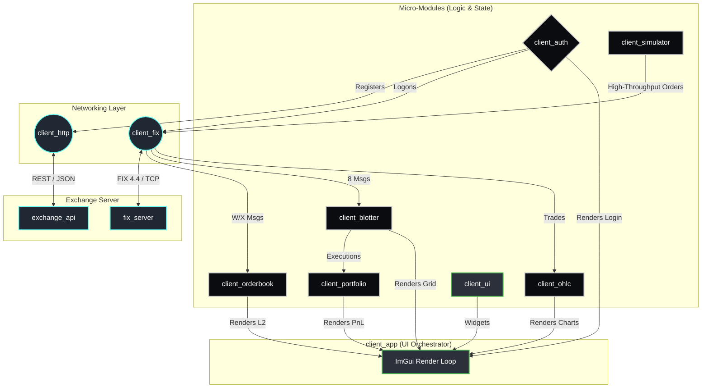

# Client | Unified Trading Application

The Client suite is the primary interface for interacting with the BetaTrader ecosystem. It has been strictly engineered using a **Micro-Module Architecture**, ensuring that every logical component of the trading platform is isolated, independently testable, and reusable.

## Architecture & Data Flow

Instead of a monolithic GUI, the `client_app` executable serves merely as a visual orchestrator. It instantiates individual C++ modules (like the Orderbook, Blotter, and HTTP Gateway) and mounts their state to the screen using Dear ImGui.



## The Micro-Modules

Explore the individual `README.md` files for deeper architecture and class diagrams on how each module is engineered:

1.  **[`client_fix`](./client_fix/README.md)**: TCP Session, Protocol Parser, and Heartbeat Engine.
2.  **[`client_http`](./client_http/README.md)**: Lightweight REST API wrapper for out-of-band requests.
3.  **[`client_auth`](./client_auth/README.md)**: Session unification (HTTP Registration + FIX Logon).
4.  **[`client_orderbook`](./client_orderbook/README.md)**: Lock-free L2 Market Depth state containers.
5.  **[`client_blotter`](./client_blotter/README.md)**: Execution tracking and order history grids.
6.  **[`client_portfolio`](./client_portfolio/README.md)**: Real-time PnL and metric aggregation.
7.  **[`client_ohlc`](./client_ohlc/README.md)**: Candlestick and volume aggregation for charting.
8.  **[`client_simulator`](./client_simulator/README.md)**: Headless multi-agent load generator.
9.  **[`client_ui`](./client_ui/README.md)**: Dear ImGui components and technical charting (ImPlot).
10. **[`client_app`](./client_app/README.md)**: The central aggregator and window manager.

## Design Philosophy

-   **State Isolation**: UI components never "own" the data. They only render snapshots from the underlying lock-free micro-modules.
-   **Thread-Safety via SPSC**: Data moves from background networking threads to the UI thread via Single-Producer Single-Consumer (SPSC) queues.
-   **Immediate Mode Rendering**: Uses Dear ImGui for 60 FPS ultra-low latency visualization of market depth.
-   **Dependency Injection**: The `client_app` injects dependencies into components, facilitating isolated mocks for unit testing.

## Building the Client

Thanks to the modular CMake configuration, you can build the entire suite or just the test harness for a specific module:

```bash
mkdir -p build && cd build

# Build everything
cmake .. && cmake --build . --target client_app client_simulator -j$(nproc)

# Build tests for a specific micro-module
cmake --build . --target client_orderbook_tests
ctest -R client_orderbook_tests
```
