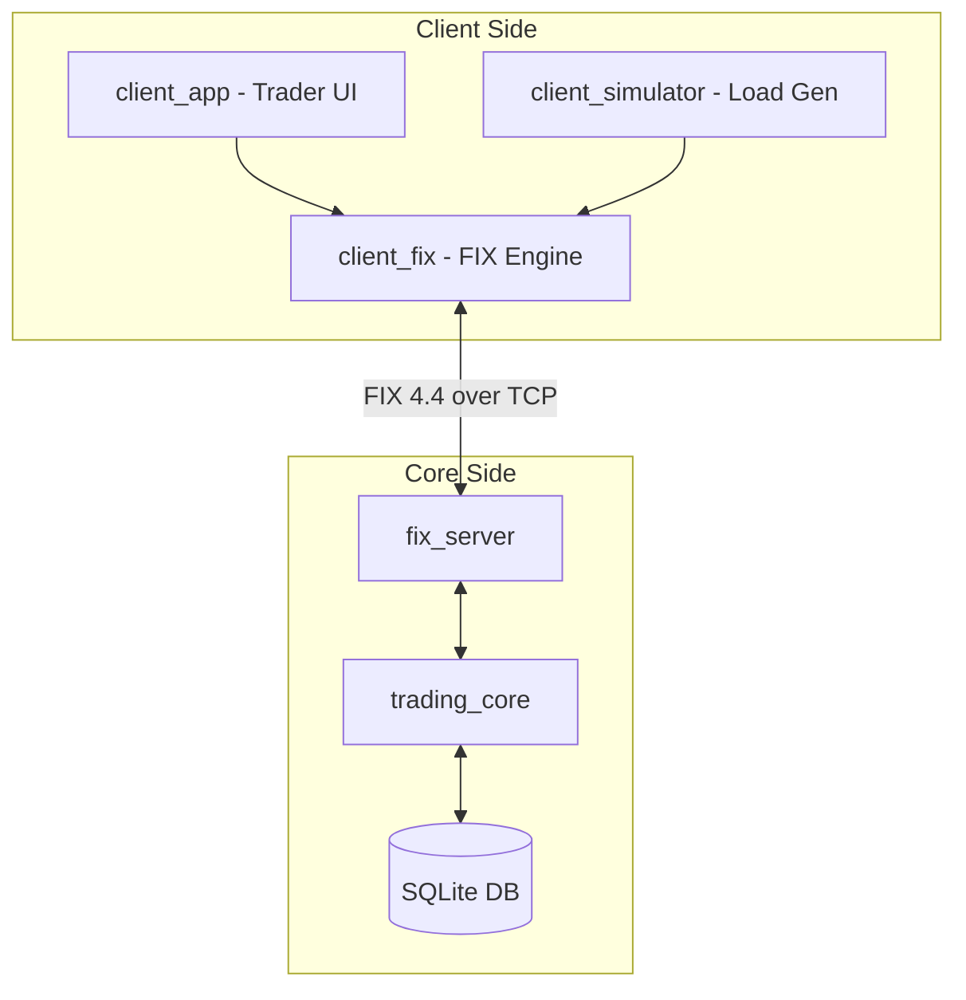
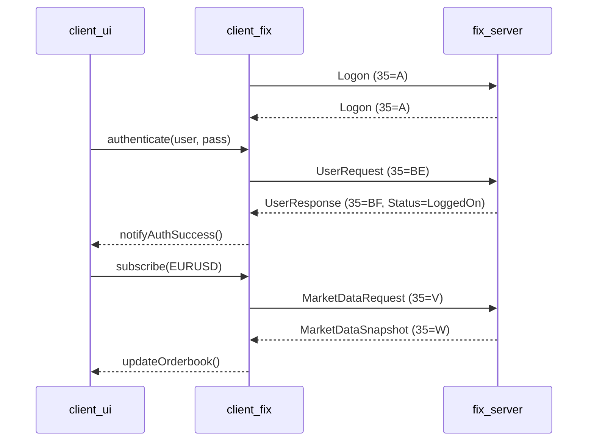

# Client Application

The Client Application (`client`) is the primary interface for interacting with the BetaTrader ecosystem. It serves a dual purpose: providing a high-performance **Trader Terminal** for manual trading and a **Load Simulator** for stress-testing the matching core.

## Overview

The client suite is designed to bridge the gap between human traders and automated systems. It connects to the `fix_server` via the standard FIX 4.2 protocol, enabling secure authentication, real-time market data visualization, and sub-millisecond order routing.

Whether you are looking to trade manually via a modern GUI or simulate thousands of concurrent users to test system limits, the `client` module provides the necessary infrastructure.

## Key Responsibilities

-   **Secure Authentication**: Handles client registration and encrypted login flows to the FIX server.
-   **FIX Session Management**: Robust handling of sequence numbers, heartbeats, and automatic reconnection.
-   **Real-time Visualization**:
    -   **Interactive Graphs**: Live price action using high-performance charting.
    -   **Dynamic Orderbook**: Level 2 visualization showing market depth.
-   **Order Lifecycle Management**: intuitive order entry (Limit/Market) and a real-time order blotter to track fills and rejections.
-   **Stress Testing**: A dedicated simulation engine capable of spawning thousands of headless FIX clients to benchmark core throughput and latency.

## Getting Started

To build and run the client applications, follow these steps:

### Build
```bash
# From the project root
mkdir -p build && cd build
cmake ..
cmake --build . --target client_app client_simulator
```

### Run Trader Terminal
```bash
./client/client_app
```

### Run Load Simulator
```bash
./client/client_simulator --clients 1000 --rate 50
```

## Architecture

The BetaTrader Client suite follows a modular "FIX-First" principle, where both the graphical UI and the headless simulator share a common protocol engine.



## Interaction Flows

### Secure Auth & Subscription


## Design Conventions

-   **Lock-Free UI Core**: Communication between the FIX thread and the UI thread is handled via an SPSC `UIEventQueue` to prevent GUI stutters.
-   **Reconnect Backoff**: Exponential backoff policy for session re-establishment to avoid thundering herd on server restarts.
-   **Zero-Allocation Paths**: Hot-paths in the simulator are heap-allocation-free to ensure accurate benchmarking.

## Further Reading

For a detailed technical breakdown of the individual modules, please refer to:

-   **[`client_fix` Details](./client_fix/README.md)**: Protocol engine, session management, and auth specs.
-   **[`client_ui` Details](./client_ui/README.md)**: ImGui architecture, Orderbook model, and subscription logic.
-   **[`client_simulator` Details](./client_simulator/README.md)**: Performance benchmarking and rate control.
