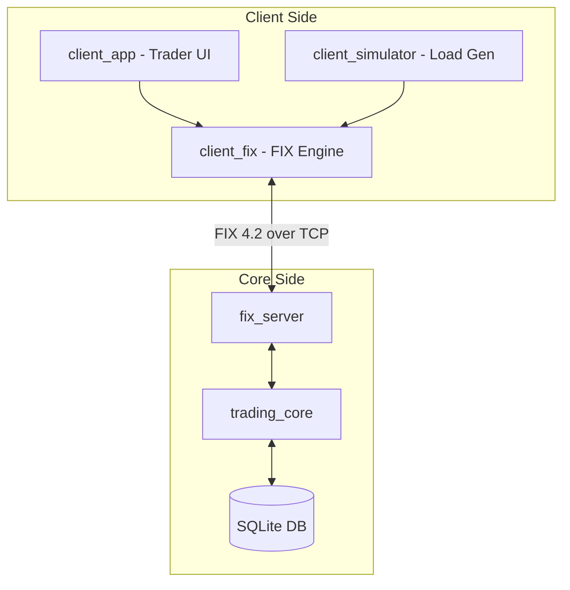
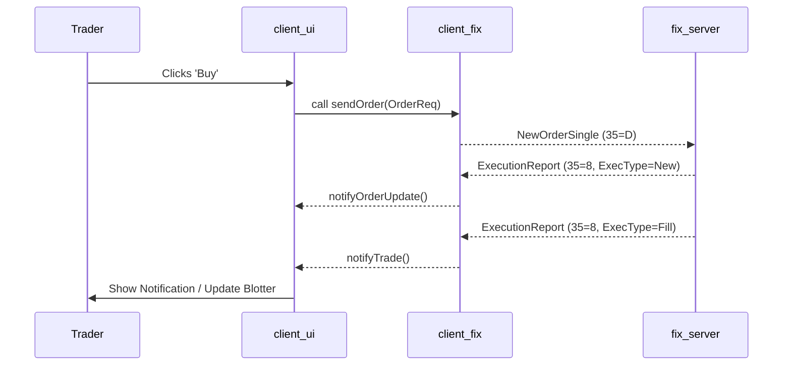

# Client Application - Technical System Design (TSD)

## 1. Overview

The BetaTrader Client suite is a high-performance frontend architecture designed to interface with the matching core. It is built on a modular "FIX-First" principle, where both the graphical UI and the headless simulator share a common protocol engine.

## 2. Architecture

The system is composed of two primary applications and a shared protocol core:

## 3. Modules

### 3.1 `client_fix` (Protocol Engine)
The common foundation for all client-side FIX communication.
-   **Responsibilities**: TCP connection management (ASIO), message serialization, session state persistence, and sequence number synchronization.
-   **Key Components**:
    -   **`FixClientSession`**: Asynchronous state machine handling the FIX lifecycle (Logon -> Heartbeat -> Logout).
    -   **`ClientMessageBuilder`**: Specialized builder for creating outbound trades and market data subscriptions.
    -   **`AuthManager`**: Handles the registration and login handshakes, including custom authentication tags.

### 3.2 `client_ui` (Trader Terminal)
A rich, immediate-mode GUI for human traders.
-   **Technology**: **Dear ImGui** with **ImPlot** for high-frequency graphing.
-   **Key Panels**:
    -   **AuthPanel**: Login/Register forms.
    -   **MarketDepthPanel**: Level 2 Orderbook visualization with real-time bid/ask pressure.
    -   **ChartingPanel**: Time-series graphs for symbol price action.
    -   **OrderEntryPanel**: Quick-fire order buttons and validation.
    -   **BlotterPanel**: Filterable table of all execution reports and active orders.

### 3.3 `client_simulator` (Stress Tester)
A headless, high-concurrency engine for system benchmarking.
-   **Responsibilities**: Launching a configurable number of virtual clients, each running an independent FIX session.
-   **Features**:
    -   **Workload Profiles**: Simulation of various behaviors (e.g., aggressive market takers, passive market makers).
    -   **Metrics Collection**: Tracking end-to-end latency (RTT) and throughput (Messages Per Second).
    -   **Thread Management**: Utilizes an ASIO `thread_pool` to scale connections across CPU cores.

## 4. Interaction Flows

### 4.1 Order Lifecycle (UI)

## 5. Design Conventions

-   **Lock-Free UI Core**: The `client_ui` maintains a local "view-model" cache. Updates from the `client_fix` background thread are pushed into a thread-safe queue to be drained by the UI rendering loop, preventing GUI stutters.
-   **Zero-Allocation Path**: In the `client_simulator`, the hot-path for message generation avoids heap allocations to ensure benchmarking results reflect the core server's performance rather than client-side overhead.
-   **Modular Drivers**: The UI is decoupled from the specific rendering backend (GLFW/OpenGL), allowing it to be compiled for different platforms or even as a web-app via Emscripten.
