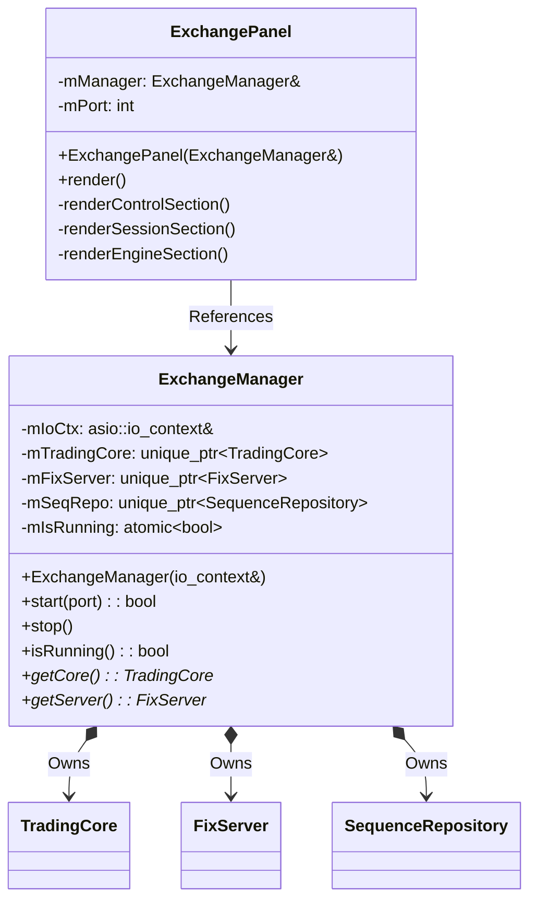

# Client | Admin — Embedded Exchange Controller

The `client_admin` module provides the ability to run a **local, in-process exchange instance** directly from the client application. This allows developers and testers to start, stop, and monitor a full TradingCore + FIX server without deploying a separate exchange binary.

## Architecture

## Key Components

### 1. `ExchangeManager`
Lifecycle controller for a local exchange instance.
-   **Startup Sequence**: Cleans stale sequence files → initializes `TradingCore` → seeds a default `CLIENT1` authorization → initializes `SequenceRepository` → starts `FixServer` on the configured port.
-   **Shutdown**: Stops the FIX server, releases the sequence repository, then stops and destroys the trading core.
-   **State Management**: Uses `std::atomic<bool>` for safe cross-thread status checking.

### 2. `ExchangePanel`
ImGui panel for controlling and monitoring the embedded exchange.
-   **Control Section**: Start/Stop button with port configuration. Displays online/offline status with color coding.
-   **Sessions Tab**: Live table of all authenticated FIX sessions (SenderCompID, login status, inbound/outbound sequence numbers). Uses a thread-safe snapshot from `FixSessionManager::getAllSessionStates()`.
-   **Engine Stats Tab**: Displays partition activity for each instrument (placeholder for queue depth metrics).

## Dependencies

-   `exchange_app_lib` — `TradingCore` and its orchestration.
-   `fix_lib` — `FixServer` and `FixSessionManager`.
-   `client_ui_lib` — ImGui context and include paths.
-   `common` — Shared types (`Instrument`, logging).
