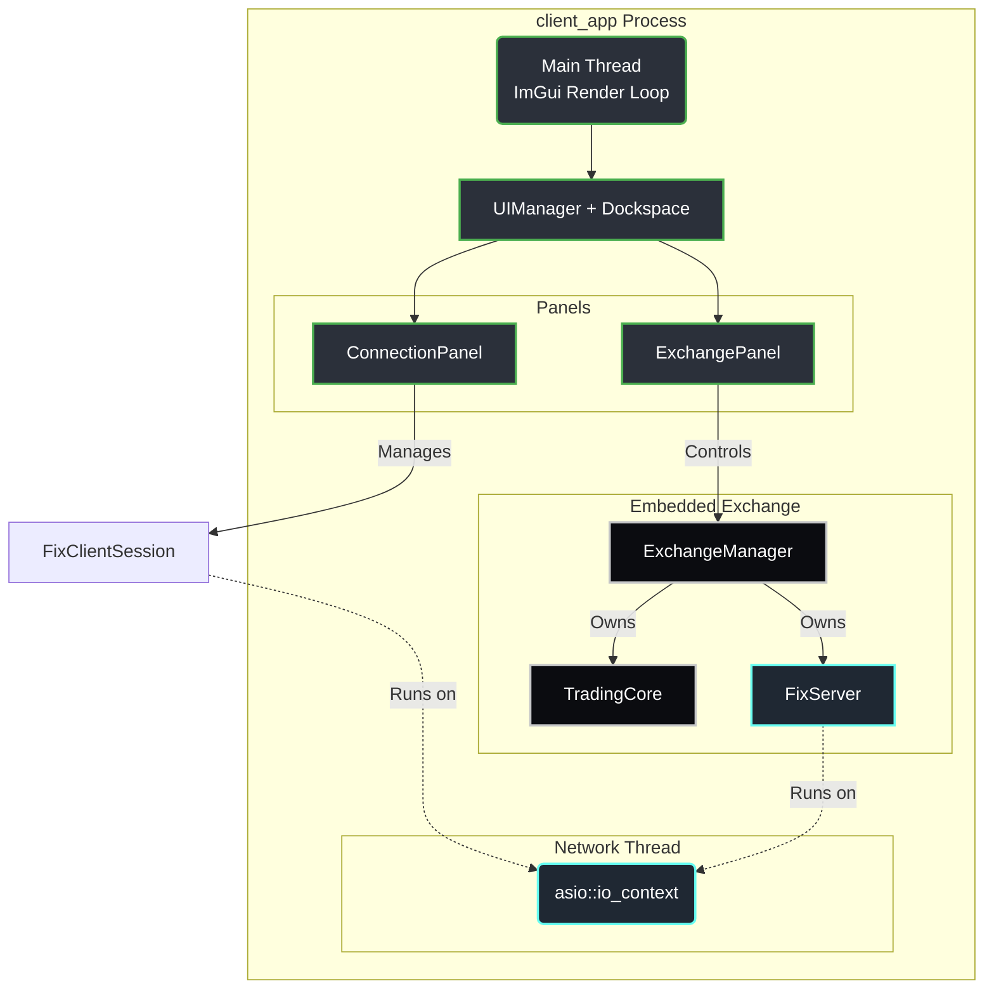
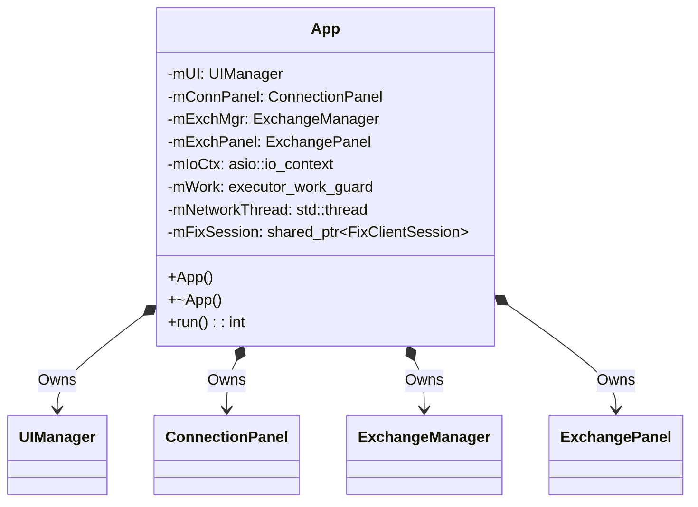

# Client | App Orchestrator

The `client_app` is the central executable for the BetaTrader client suite. It acts as the composition root: owning the ASIO networking context, instantiating UI and exchange modules, and driving the 60 FPS ImGui render loop.

## Overview

This application bridges the gap between raw trading data (maintained by pure C++ micro-modules) and a human-readable interface. It coordinates the lifecycle of the embedded local exchange, the FIX client session, and the Dear ImGui rendering context.

## Key Responsibilities

*   Initialize the GLFW/OpenGL3 window and ImGui context (via `client_ui::UIManager`).
*   Own the `asio::io_context` and run it on a dedicated network thread.
*   Instantiate and wire the `ExchangeManager` (local exchange), `ConnectionPanel` (FIX session UI), and `ExchangePanel` (exchange monitor).
*   Drive the main render loop until window close.
*   Handle graceful shutdown (stop io_context → join network thread → destroy UI).

## Architecture

## Class Diagram

## Component Responsibilities

| Component | Description |
| :--- | :--- |
| **`App`** | The composition root. Constructs all modules, starts the network thread in the constructor, and enters the render loop in `run()`. |
| **`UIManager`** | Manages GLFW window and ImGui context lifecycle (from `client_ui`). |
| **`ConnectionPanel`** | ImGui panel for FIX session management — connect, logon, logout, message log (from `client_ui`). |
| **`ExchangeManager`** | Manages the lifecycle of an embedded local TradingCore + FixServer (from `client_admin`). |
| **`ExchangePanel`** | ImGui panel for monitoring and controlling the local exchange (from `client_admin`). |

## Critical Design Conventions

-   **Composition Root**: `App` is the only class that wires dependencies together. Panels receive references, not owned pointers.
-   **Two-Thread Model**: The main thread runs the ImGui render loop; a dedicated background thread runs `io_context::run()` for all async networking.
-   **Work Guard**: `asio::make_work_guard` keeps the network thread alive even when no async operations are pending.
-   **Shutdown Order**: Stop work guard → stop io_context → join network thread → destroy UI context.
