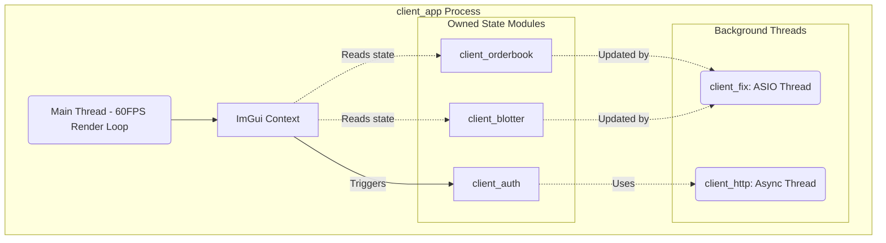
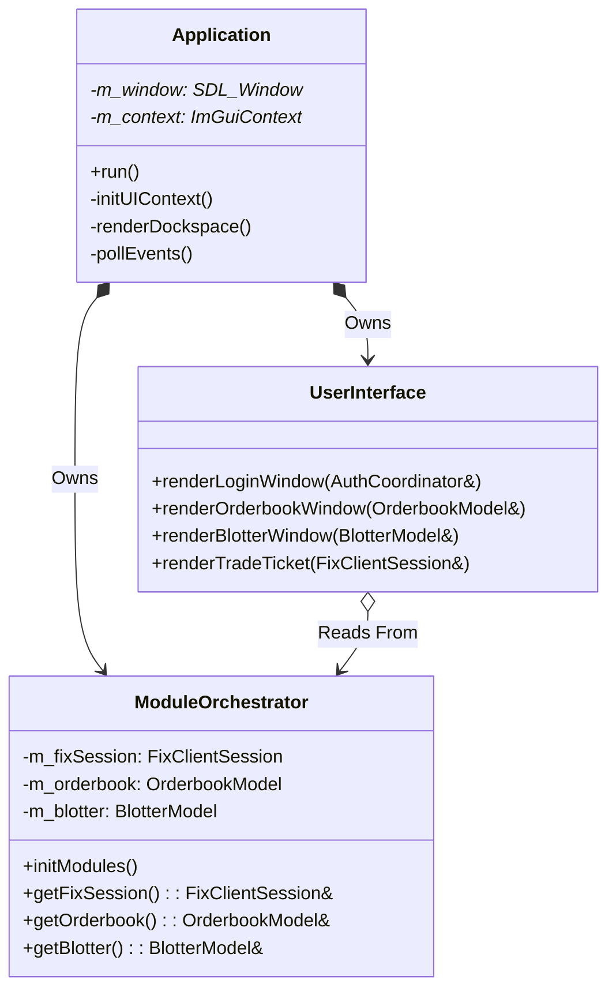

# Client | App Orchestrator

The `client_app` is the central executable and UI layer for the BetaTrader client suite. Unlike a monolithic GUI, `client_app` contains virtually no business logic. Instead, it acts purely as an ImGui-based visualizer that mounts and displays the state of independently compiled, rigorously tested micro-modules.

## Overview

This application bridges the gap between raw trading data (maintained by pure C++ micro-modules) and a human-readable interface. It orchestrates the lifecycle of all network connections, handles user inputs (like clicks and text entry), and drives a 60 FPS rendering loop.

## Key Responsibilities

*   Initialize the OpenGL3 and SDL2 contexts.
*   Instantiate and own the core trading micro-modules (e.g., `OrderbookModel`, `FixClientSession`).
*   Map the underlying lock-free data structures directly to Dear ImGui rendering calls.
*   Route UI interactions (button clicks) down into network command queues.
*   Manage dockspace layouts and UI theming.

## Architecture

## Class Diagram

## Component Responsibilities

| Component | Description |
| :--- | :--- |
| **`Application`** | The main execution wrapper. Handles OS-level windowing, input polling, and the master `while(running)` loop. |
| **`ModuleOrchestrator`** | The dependency injection container. Instantiates the FIX session, HTTP wrapper, and underlying data models, wiring their callbacks together. |
| **`UserInterface`** | Contains all the internal ImGui layout code. Broken down internally into separate functions per dockable window panel. |

## Critical Design Conventions

-   **Zero Business Logic in UI**: The `UserInterface` class must not calculate PnL, validate orders, or parse network strings. It solely loops over arrays and renders text/rectangles.
-   **Lock-Free Reading**: The renderer reads from state modules (`client_orderbook`) that use atomic snapshots or SPSC queues to avoid halting the background FIX network threads.
