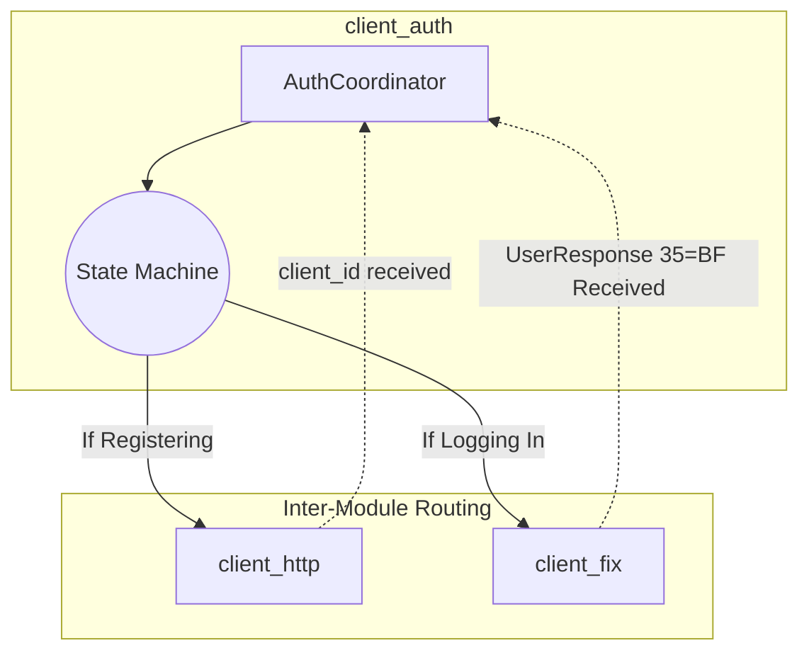
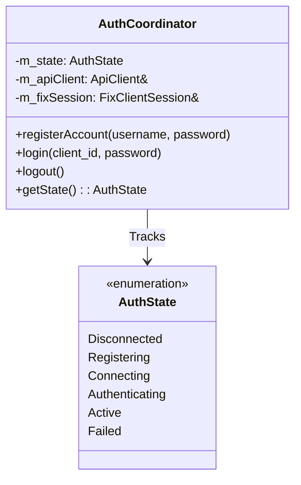

# Client | Auth & Session Manager

The `client_auth` module is responsible for the overall lifecycle of the user's secure connection, orchestrating both HTTP and FIX channels.

## Overview

Identity management in trading systems usually spans multiple protocols. You register via HTTP to acquire credentials, then connect via FIX to authenticate a trading session. `client_auth` bridges these two distinct operations into a single, unified state machine that the user interface can track.

## Key Responsibilities

*   Provide a unified `AuthState` enum for the UI to bind to.
*   Coordinate the HTTP-based Registration flow.
*   Coordinate the FIX-based Logon (`35=A`) and UserRequest (`35=BE`) flows.
*   Securely hold the active `SenderCompID` assigned to the client.

## Architecture

## Class Diagram

## Component Responsibilities

| Component | Description |
| :--- | :--- |
| **`AuthCoordinator`** | The central manager. It takes references to both `ApiClient` and `FixClientSession` at initialization and drives them based on user requests. |
| **`AuthState`** | A robust enum representing the exact step in the connection lifecycle, intended to be polled by ImGui to update loading spinners and error labels. |

## Critical Design Conventions

-   **Delegation**: `client_auth` does not parse FIX tags or JSON itself; it relies entirely on its sibling modules (`client_fix` and `client_http`) and only handles the business logic of *when* to execute them.
-   **Thread-Safety**: State changes triggered by asynchronous callbacks from the networking threads are protected via mutexes so the UI can read `getState()` safely.
