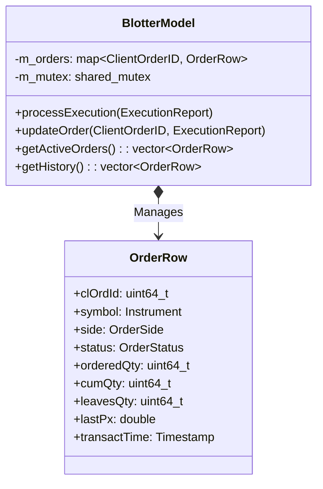

# Client | Execution Blotter

The `client_blotter` module acts as the historical ledger for the trading session, maintaining an immutable, sortable, and searchable collection of order states based on incoming `ExecutionReport (35=8)` messages from the exchange.

## Overview

The blotter is the trader's interface into their own activity. By storing the transition of orders from `New` -> `PartiallyFilled` -> `Filled` (or `Cancelled`/`Rejected`), it provides the data necessary to populate the UI tables showing Order History and Active Trades.

## Key Responsibilities

*   Automatically track the lifecycle of every order submitted by the client instance.
*   Parse `ExecutionReport (35=8)` variant messages received from the `client_fix` module.
*   Provide thread-safe extraction methods formatted explicitly for large ImGui Tables.
*   Retain idempotency across identical reports by using `ClientOrderID` as a strict primary key.

## Architecture

```mermaid
graph TD
    subgraph "client_fix"
        RECEIVER[FixMessageParser]
    end

    subgraph "client_blotter Module"
        ROUTER[ExecutionRouter]
        MODEL[BlotterModel]
    end

    RECEIVER -->|ExecutionReport (35=8)| ROUTER
    ROUTER -->|Update/Insert| MODEL
    MODEL -.->|getHistory()| UI(client_app UI Table)
```

## Class Diagram



## Component Responsibilities

| Component | Description |
| :--- | :--- |
| **`BlotterModel`** | The central state container owning all historically observed orders. |
| **`OrderRow`** | A localized POD struct combining relevant FIX tags into a flat format optimized for rapid GUI tabular rendering. |
| **`processExecution()`** | Examines the `ExecType` and `OrdStatus` of an incoming message to intelligently update cumulative quantities or flag the order as Terminated. |

## Critical Design Conventions

-   **Primary Key Integrity**: Every `OrderRow` is tracked exclusively by its `ClientOrderID (11=)`. Late or duplicate `ExecutionReports` are processed robustly by overriding the row's state rather than duplicating entries.
-   **Render-Focused Retrieval**: Returns standard `std::vector` snapshots via shared read-locks, ensuring the UI grid component never blocks the high-priority FIX background thread during heavy update bursts.
