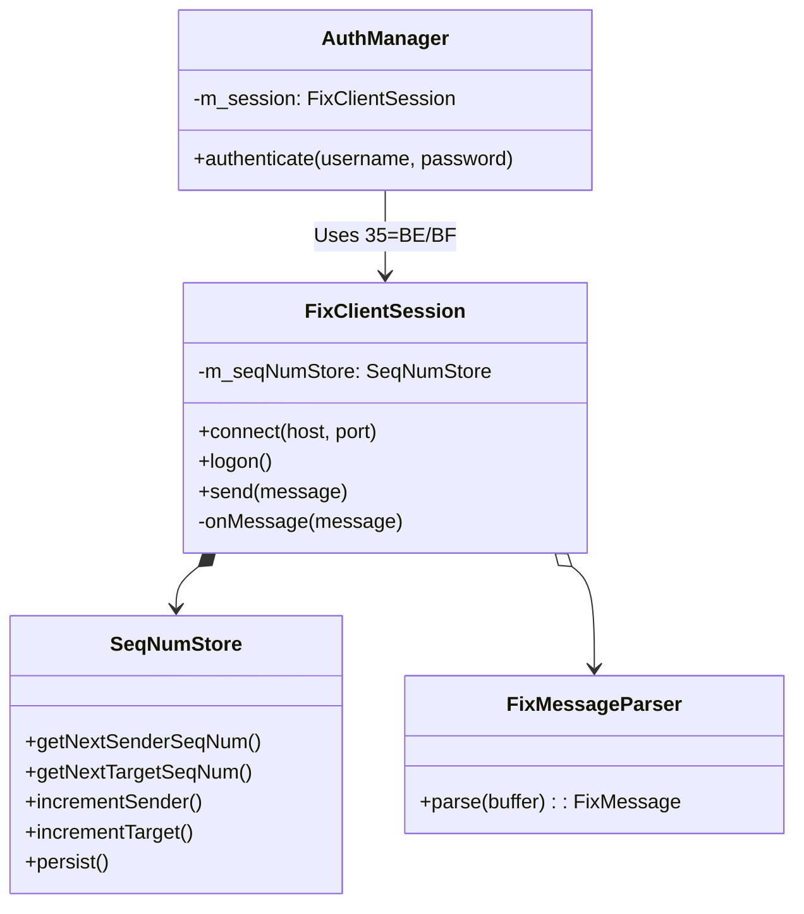

# client_fix — Protocol Engine

The `client_fix` module is the backbone of the BetaTrader client suite. It provides a robust, asynchronous implementation of the FIX protocol, ensuring reliable session management and high-performance message handling.

## Architecture

## Key Components

### 1. `FixClientSession`
The central state machine managing the TCP connection and FIX session lifecycle.
-   **Asynchronous I/O**: Leverages Boost.ASIO for non-blocking network operations.
-   **State Management**: Handles transitions between `Disconnected`, `Connecting`, `LogonSent`, `Synchronizing`, and `Active`.
-   **Heartbeat Logic**: Automatic generation of `Heartbeat (35=0)` messages and monitoring of peer heartbeats.

### 2. `SeqNumStore`
A persistence layer for tracking sequence numbers (`34=MsgSeqNum`) across application restarts.
-   **Storage**: Persists to a local flat file or SQLite table.
-   **Recovery**: Automatically restores sequence numbers on startup to prevent session resets or `ResendRequest` (35=2) loops.

### 3. `AuthManager`
Implements the security handshake using FIX 4.4 standards.
-   **Standard Implementation**: Uses `UserRequest (35=BE)` with `UserRequestType=1` (Logon) and `Username`/`Password` fields.
-   **Callback-driven**: Notifies the application of authentication success or failure via `UserResponse (35=BF)`.

### 4. `FixMessageParser`
A high-performance parser designed for low-latency environments.
-   **Zero-Copy Design**: Extracts tag-value pairs using `std::string_view` into a flat map or specialized struct, minimizing heap allocations.
-   **Validation**: Basic checksum and structure verification before passing messages to the session logic.

## Design Decisions

-   **Thread Safety**: The engine is designed to run on a dedicated ASIO `io_context` thread. All outbound message sends from the UI thread are posted to this context to avoid locking.
-   **Resilience**: Implements a configurable exponential backoff strategy for reconnection attempts.
-   **FIX 4.4 Focus**: Although the core matching engine is minimal, the client uses FIX 4.4 semantics for authentication to ensure forward compatibility with modern trading standards.
