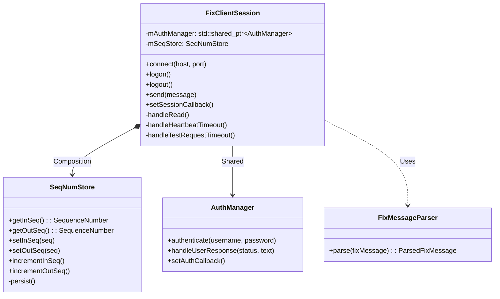

# Client | FIX Protocol Engine

The `client_fix` module provides the core connectivity, message parsing, and session management required for the BetaTrader client to interact with the FIX matching engine. It handles asynchronous networking, authenticates users, normalizes sequence numbers, and exposes structured domain objects to the rest of the application.

## Architecture

## Key Components

### 1. `FixClientSession`
The central state machine managing the asynchronous TCP connection and FIX session lifecycle using Boost.Asio.
-   **Session State**: Actively manages transitions connecting, authenticating (Logon 35=A), synchronizing sequence numbers, and maintaining an active session.
-   **Keep-Alive**: Periodically sends `Heartbeat (35=0)` messages. If peer is unresponsive, sends `TestRequest (35=1)` and eventually disconnects if no response is received.
-   **Sequence Management**: Automatically detects server sequence gaps and processes `SequenceReset (35=4)` and `ResendRequest (35=2)`. Client explicitly relies on `SequenceReset-GapFill` behavior when caching outbound messages is not required.

### 2. `SeqNumStore`
A persistence layer ensuring message continuity across client restarts and dropped connections.
-   **Storage**: Writes strictly to isolated `.seq` flat files based on Target and Sender IDs or configurable directory paths (beneficial for test isolation).
-   **Synchronization**: Automatically updates inward/outward sequences when reading/writing valid FIX messages.

### 3. `AuthManager`
Handles user identification securely over the FIX connection.
-   **Security**: Initiates the handshake by queueing a `UserRequest (35=BE)` with the credentials. 
-   **Flow**: Validates `UserResponse (35=BF)` messages to finalize the login handshake successfully, or triggers failure alerts via callbacks.

### 4. `FixMessageParser`
A high-performance tag-value dictionary extractor and domain object builder.
-   **Validation**: Strictly enforces standard message structures, SOH delimiter checking, missing mandatory tags, and exact matching of calculated versus expected checksums (10=).
-   **Strict Typing**: Converts parsed structures containing strings/string_views directly into typed domain classes (e.g., `ExecutionReport`, `MarketDataSnapshotFullRefresh` via `std::variant`), abstracting protocol intricacies away from business logic.

## Usage and Extensions
-   **Threading**: Run the `FixClientSession` event loop from a dedicated worker thread `io_context.run()` to perform non-blocking I/O.
-   **Testing**: Test cases implement 100% path coverage for the entire module by utilizing friend class overrides and custom sequence directories (`session_test_store/`).
