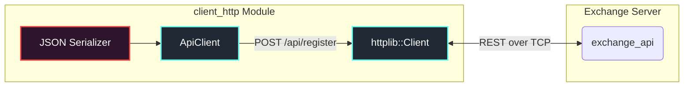
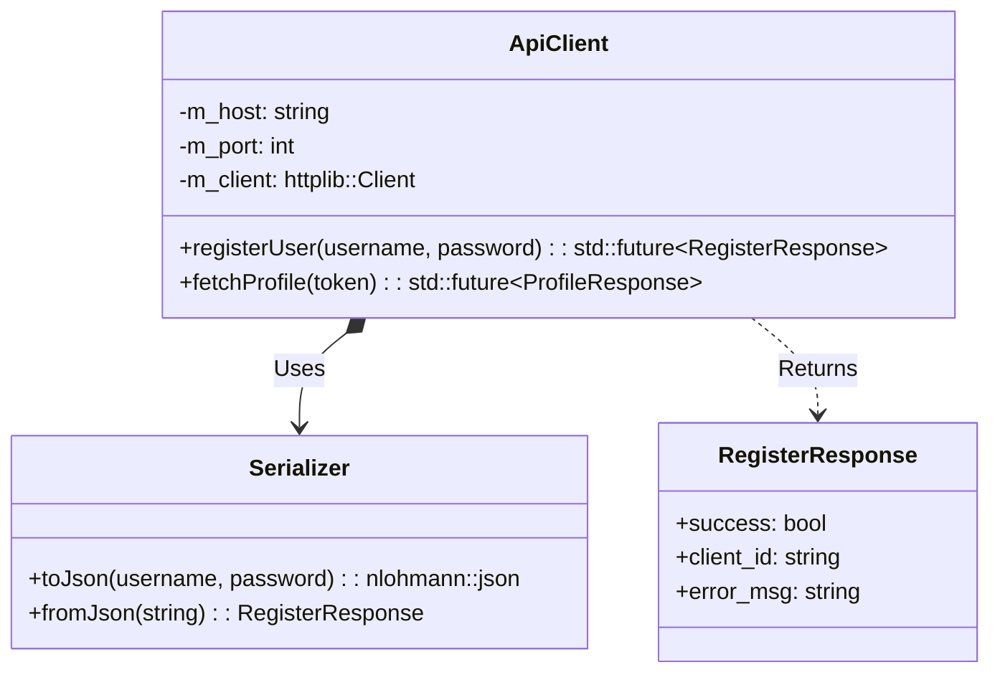

# Client | HTTP Gateway Wrapper

The `client_http` module acts as a lightweight REST interface wrapper for operations outside the scope of the FIX protocol.

## Overview

While the bulk of low-latency trading traffic routes over FIX, operations like User Registration, Profile Management, and downloading deep historical datasets securely utilize this HTTP gateway. This module abstracts away raw socket connections and JSON serialization.

## Key Responsibilities

*   Establish secure REST connections to the `exchange_api` gateway.
*   Serialize C++ domain structs into JSON requests.
*   Parse incoming JSON responses into C++ domain structs.
*   Provide a non-blocking asynchronous API to prevent UI freezes.

## Architecture

## Class Diagram

## Component Responsibilities

| Component | Description |
| :--- | :--- |
| **`ApiClient`** | The primary public surface. Wraps `.get()` and `.post()` operations, abstracting endpoints into semantic C++ methods. |
| **`Serializer`** | Contains static methods that utilize `nlohmann/json` to translate to/from API payload strings. |
| **`RegisterResponse`** | A Plain-Old-Data (POD) struct representing the status of an account creation request. |

## Critical Design Conventions

-   **Asynchronous Interface**: All network calls return `std::future<T>` or utilize callbacks to ensure the `client_app` render loop is never blocked by network latency or timeouts.
-   **Header-Only Backbone**: Built cleanly on top of `cpp-httplib` and `nlohmann/json` to ensure cross-platform compatibility without heavy binary linking.
