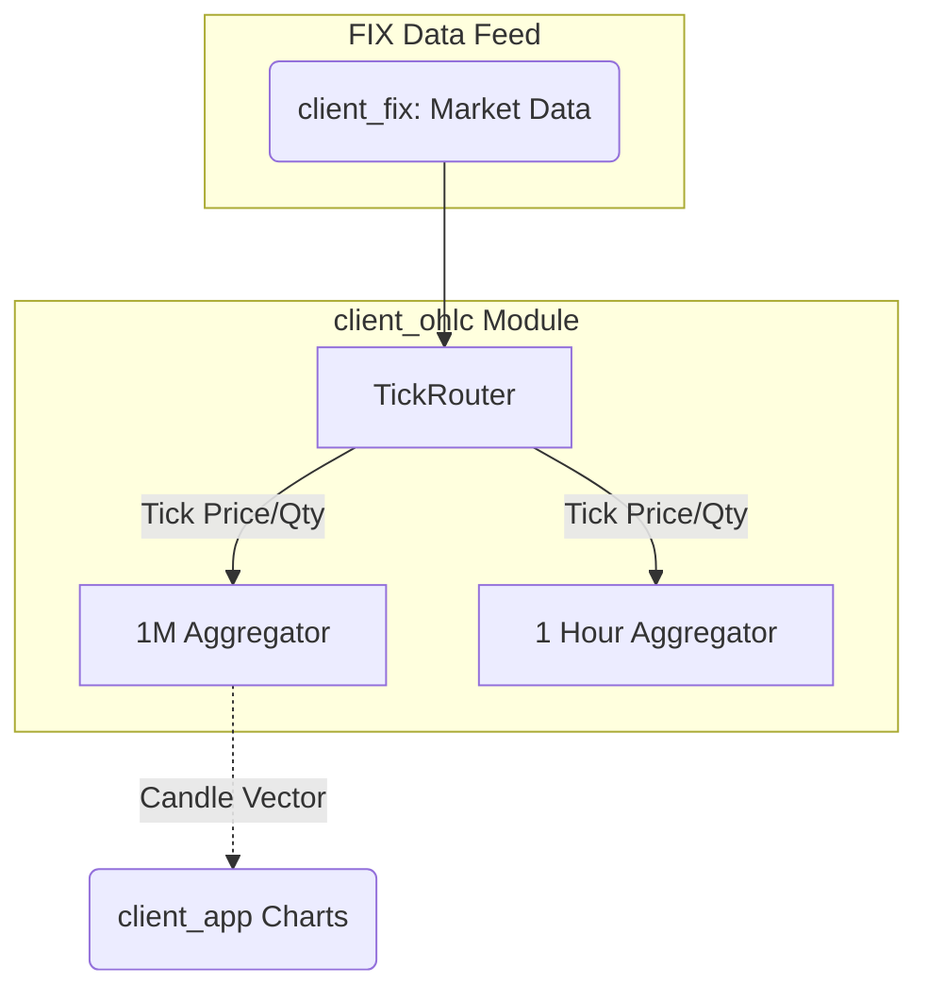
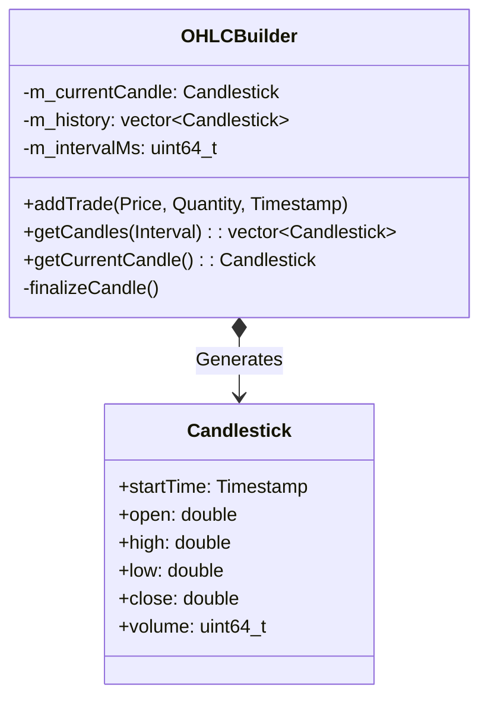

# Client | OHLC Aggregator

The `client_ohlc` (Open-High-Low-Close) module listens to a continuous stream of executions and market trades, converting them into discrete, time-bucketed candlesticks optimized for technical analysis and charting.

## Overview

Live market data arrives as a firehose of individual ticks. To display a readable financial chart, `client_app` relies entirely on this module to mathematically slice the data into defined intervals (e.g., 1m, 5m, 1H). 

## Key Responsibilities

*   Process rapid `MarketDataIncrementalRefresh (35=X)` or Trade sequences.
*   Aggregate ticks into sequential time intervals based on configured granularities.
*   Maintain the current 'live' unfinalized candle.
*   Format output vectors specifically for graphing libraries (like `ImPlot`).

## Architecture

## Class Diagram

## Component Responsibilities

| Component | Description |
| :--- | :--- |
| **`OHLCBuilder`** | State machine assigned to a specific string of intervals and a specific symbol. Dictates when a candle closes. |
| **`Candlestick`** | Mathematical container. The core unit recognized universally by charting tools. |
| **`addTrade()`** | Immediately updates the `high`, `low`, and `close` properties of the active candle. Pushes it to `m_history` if the tick's timestamp crosses the `m_intervalMs` threshold. |

## Critical Design Conventions

-   **Memory Contiguous Output**: The `m_history` vector must be memory-contiguous so that visualizers like `ImPlot` can map array pointers directly to GPU buffers without iterating through objects.
-   **No UI Dependency**: This module is completely detached from the renderer; it merely holds the arrays.
