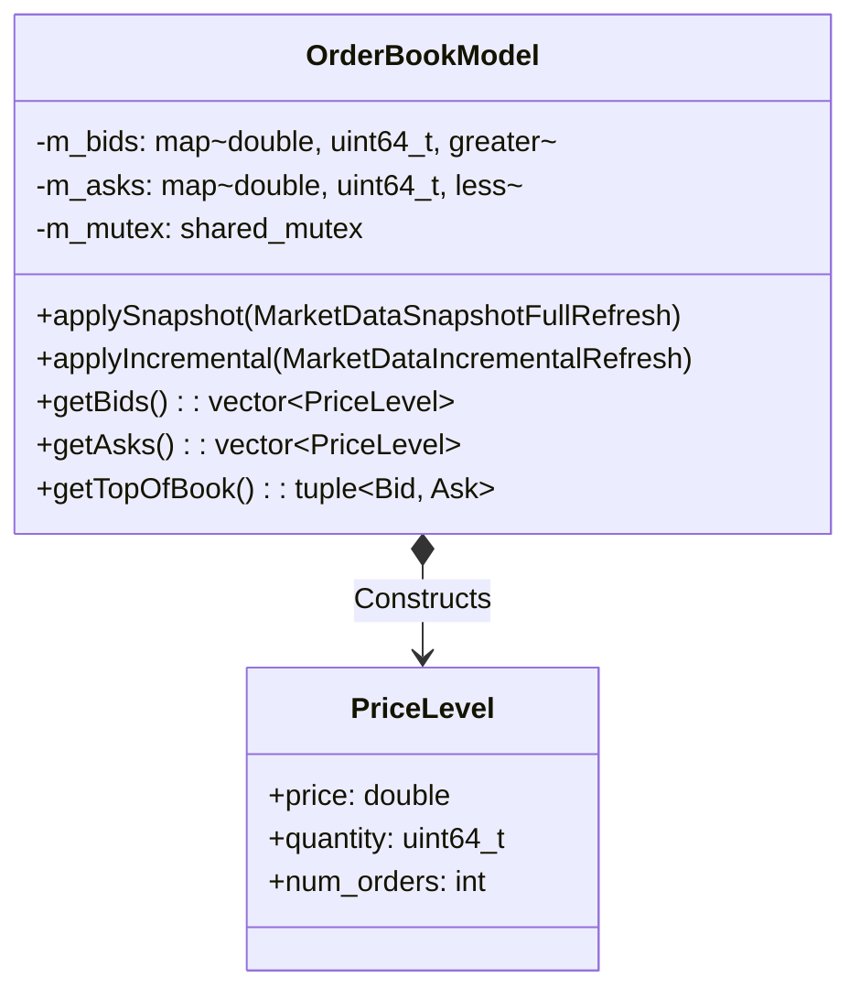

# Client | L2 Orderbook

The `client_orderbook` module is the state management engine for Level 2 Market Data. 

## Overview

The orderbook bridges the gap between raw, asynchronous FIX messages and a stable memory layout suitable for 60 FPS rendering. It consumes `MarketDataSnapshotFullRefresh (35=W)` sweeps and `MarketDataIncrementalRefresh (35=X)` delta updates, translating them into a navigable Depth of Market (DoM).

## Key Responsibilities

*   Maintain an accurate, in-memory representation of Bids and Asks for a specific symbol.
*   Apply incoming FIX market data updates deterministically.
*   Sort price levels efficiently so Top-Of-Book (TOB) is always easily accessible.
*   Provide thread-safe extraction vectors for the `client_app` UI layer.

## Architecture

```mermaid
graph TD
    subgraph "client_fix"
        PARSER[FixMessageParser]
    end

    subgraph "client_orderbook"
        ROUTER[MessageRouter] -->|35=W| SNAP(SnapshotHandler)
        ROUTER -->|35=X| INC(IncrementalHandler)
        
        SNAP --> BOOK[OrderBookState]
        INC --> BOOK
    end

    PARSER -->|Variant Event| ROUTER
    BOOK -->|getBids() / getAsks()| UI(client_app UI)
```

## Class Diagram



## Component Responsibilities

| Component | Description |
| :--- | :--- |
| **`OrderBookModel`** | The state container for a single instrument's Depth of Market. |
| **`PriceLevel`** | A POD struct detailing the aggregated quantity available at a specific price point. |
| **Snapshot Application** | Automatically clears the existing bids/asks and reconstructs the book from a `35=W` sweep. |
| **Incremental Application** | Uses the `MDUpdateAction` tag to insert, update, or delete specific prices based on a `35=X` streaming update. |

## Critical Design Conventions

-   **Red-Black Tree Sorting**: Bids are stored in a `std::map` using `std::greater<double>` to keep the highest bid at the front. Asks use `std::less<double>` to keep the lowest ask at the front.
-   **Reader-Writer Locks**: Employs `std::shared_mutex`. The background FIX thread takes a write lock when applying updates, whilst the UI thread takes a shared read lock to extract display vectors without stalling.
