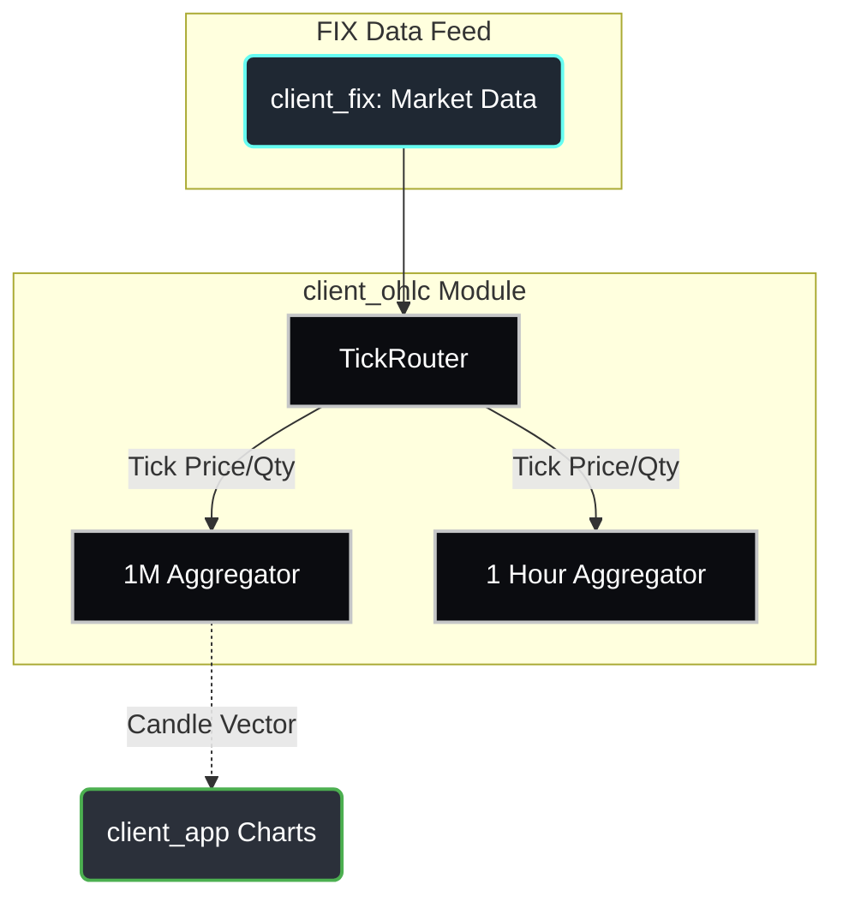
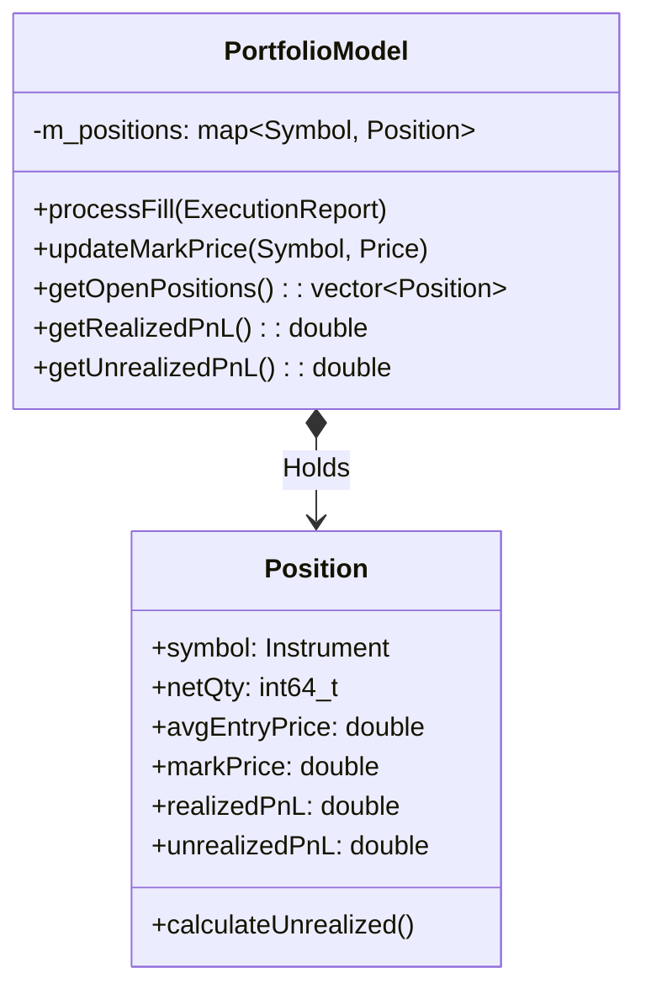

# Client | Portfolio & Risk

The `client_portfolio` module calculates real-time profit and loss (PnL), margin utilization, and aggregate positional exposure. 

## Overview

A trader needs to know their current risk exposure instantly. This module connects the historical fill data maintained by `client_blotter` with the live tick prices observed by `client_orderbook` to calculate dynamic metrics such as Volume Weighted Average Price (VWAP) and Unrealized PnL.

## Key Responsibilities

*   Automatically aggregate buy and sell executions into net position quantities.
*   Calculate and maintain the rolling Average Entry Price for positions.
*   Subscribe to Top-Of-Book (TOB) market data feeds to determine Mark-to-Market PnL.
*   Provide unified risk metrics for UI visualization.

## Architecture

## Class Diagram

## Component Responsibilities

| Component | Description |
| :--- | :--- |
| **`PortfolioModel`** | The state container capturing net positions across all instruments. |
| **`Position`** | Represents the netted risk exposure for a single `Instrument`. Maintains its own ongoing PnL math state. |
| **`processFill()`** | Nets quantities. Triggers Realized PnL logic if the fill is offsetting an existing position, or recalculates `avgEntryPrice` if it is an expanding position. |

## Critical Design Conventions

-   **Zero-State Assumption**: The module derives all aggregate data from execution events. Reconnecting or restarting the client requires a database load or FIX sync to re-establish the baseline average prices.
-   **Lock-Free Polling**: All math is processed on the intake thread so the UI simply pulls atomic or mutex-protected pre-calculated values when drawing the dashboard.
