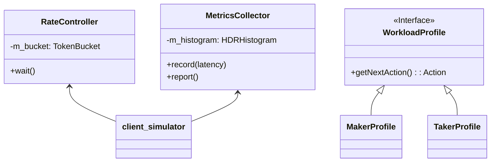
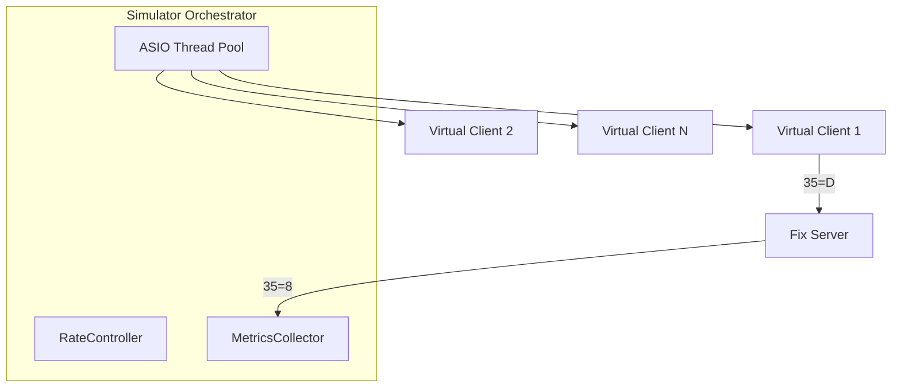

# client_simulator — Stress Tester

The `client_simulator` is a headless, high-concurrency tool designed to benchmark the BetaTrader matching engine under heavy load.

## Architecture



## Performance Components

### 1. `RateController`
Accurate traffic shaping is critical for valid benchmarking.
-   **Strategy**: Implements an **Async Token Bucket** algorithm.
-   **Implementation**: Uses `asio::steady_timer` to schedule the next message transmission based on the target TPS (Transactions Per Second). This prevents blocking the I/O threads and ensures realistic latency measurement.

### 2. `MetricsCollector`
Statistical analysis of system performance.
-   **HDR Histogram**: Uses the high-dynamic-range histogram library to record latencies with microsecond precision.
-   **Coordinated Omission**: Designed to account for delays in message sending, ensuring that the p99.99 results are accurate even when the system is saturated.
-   **Outputs**: Generates a final summary report to `stdout` and an optional CSV for time-series analysis of latency.

### 3. Workload Profiles
Simulates different market participant behaviors.
-   **Aggressive Taker**: continuously fires `Market` or aggressive `Limit` orders to cross the book and trigger trades.
-   **Passive Maker**: Places orders at the best bid/offer and cancels/re-prices them as the market moves, simulating liquidity provision.
-   **Spammer**: Extreme-rate order bursts to test the matching engine's queue handling and backpressure.

## Architecture

The simulator scales by running multiple virtual clients within a shared Boost.ASIO `thread_pool`.



## Running a Benchmark
```bash
./client_simulator --clients 500 --tps 2000 --profile taker --duration 60s
```
-   `--clients`: Number of concurrent FIX sessions.
-   `--tps`: Global target transactions per second.
-   `--profile`: The behavior script to use.
