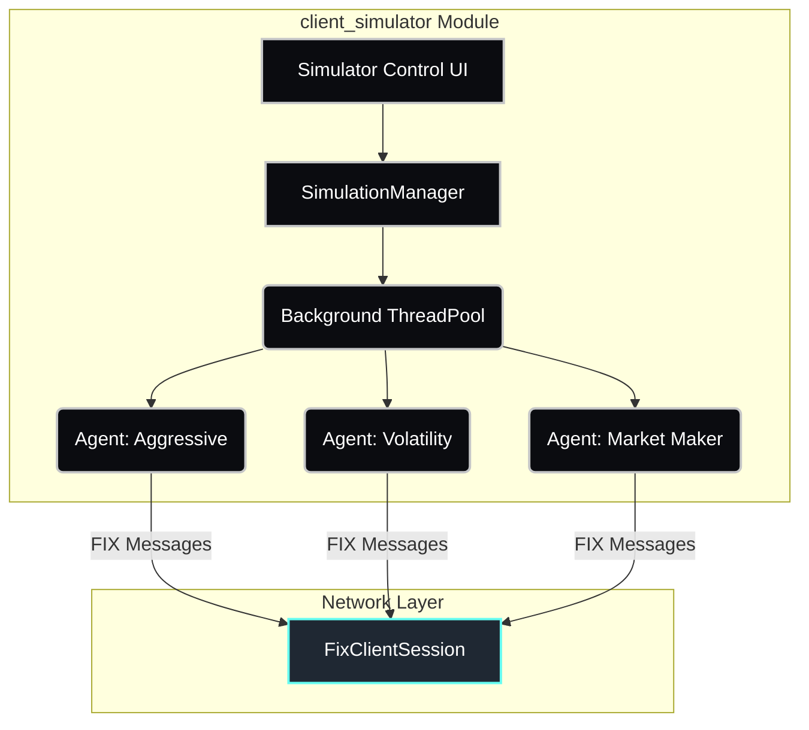
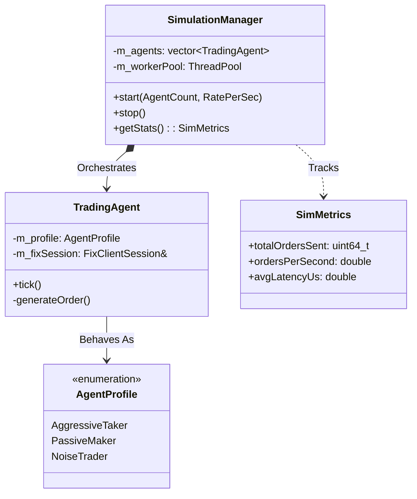

# Client | HFT Simulator

The `client_simulator` module provides a headless background engine designed to stress-test the `trading_core` Exchange by generating massive amounts of synthetic, quasi-realistic order traffic over FIX.

## Overview

The simulator bridges the gap between functional logic and extreme performance testing. Because it uses the exact same `FixClientSession` mechanisms as the standard Trader UI, it accurately validates the entire path of latency, from socket serialization to core execution and back.

## Key Responsibilities

*   Spawn thread pools independently from the UI loops.
*   Generate deterministic market scenarios and agent profiles parameters.
*   Dispatch high-throughput order bursts (`NewOrderSingle 35=D`).
*   Measure round-trip latency and aggregate global throughput metrics (Orders Per Second).

## Architecture

## Class Diagram

## Component Responsibilities

| Component | Description |
| :--- | :--- |
| **`SimulationManager`** | Top-level controller. Absorbs user inputs (e.g. 5000 clients, 100/sec) and handles the threading allocations. |
| **`TradingAgent`** | A synthetic user running in a `while(running)` loop inside the ThreadPool. Constructs and submits FIX orders. |
| **`AgentProfile`** | Defines the behavior tree: `AggressiveTaker` eats into the orderbook, `PassiveMaker` sits on limits, `NoiseTrader` randomly shifts around VWAP. |
| **`SimMetrics`** | An atomic counter struct that enables the `client_app` to chart simulator performance dynamically. |

## Critical Design Conventions

-   **Protocol Reuse**: Uses the standard `client_fix` stack. The exchange matching engine (`trading_core`) has zero awareness of whether it is communicating with a human or a high-frequency agent.
-   **Zero-Allocation Paths**: Generating random orders avoids `std::string` heap allocations and object recreation, prioritizing pure memory pools to ensure the simulation doesn't bottleneck before the target server does.
