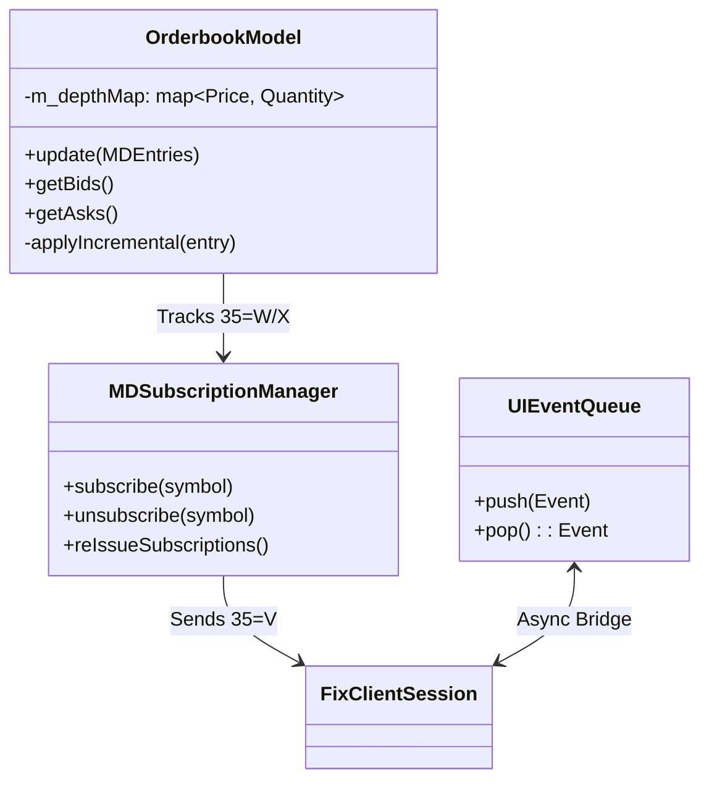
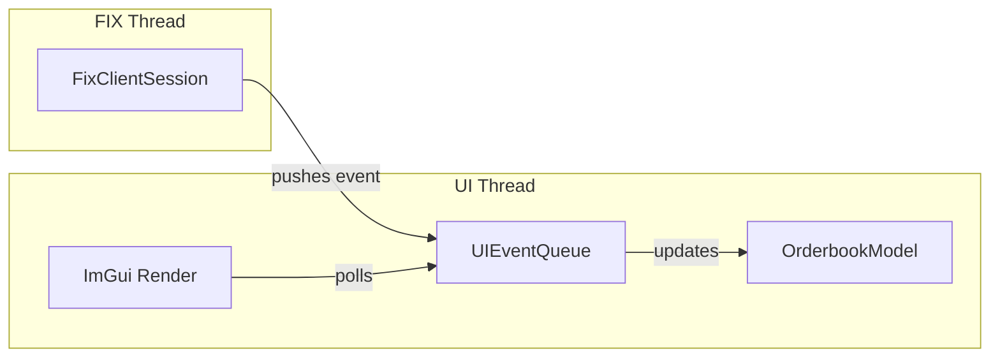

# Client | ImGui Trader Terminal

The `client_ui` module provides the interactive interface for BetaTrader. Built with **Dear ImGui**, it is designed for low overhead and high-frequency data updates.

## Architecture

## Core Architecture

The UI operates on an **Immediate Mode** paradigm where the layout is recalculated every frame. To handle the high volume of market data and executions, it uses a decoupled view-model pattern.

### 1. `OrderbookModel`
The most critical data structure in the UI.
-   **Update Logic**:
    -   `Snapshot (35=W)`: Clears existing state and performs a bulk load of the book.
    -   `Incremental (35=X)`: Applies granular updates (Add, Change, Delete) using `MDEntryID` and `MDUpdateAction`.
-   **Performance**: Optimized for O(log N) updates and O(N) rendering by maintaining sorted bins.

### 2. `MDSubscriptionManager`
Manages the lifecycle of market data requirements.
-   **Auto-Resubscribe**: Tracks symbols currently being watched and re-issues `MarketDataRequest (35=V)` messages whenever the FIX session undergoes a reconnect.
-   **Throttling**: (Optional) Can batch subscription requests during startup to avoid overwhelming the gateway.

### 3. `UIEventQueue`
The bridge between the asynchronous `client_fix` thread and the synchronous rendering loop.
-   **Data Structure**: A thread-safe SPSC (Single Producer Single Consumer) queue.
-   **Event Types**: `AuthStatusChange`, `OrderUpdate`, `TradeExecution`, `OrderBookUpdate`.

### 4. Panels & Visualization
-   **Order Entry**: Visual validation (e.g., green for buy, red for sell) and quick-action buttons.
-   **Execution Blotter**: Filterable table with color-coded status (Partial Fill, Full Fill, Canceled).
-   **Charting**: High-performance time-series visualization using **ImPlot**.

## UI-FIX Connectivity

## Setup & Dependencies
-   **Dear ImGui**: Core GUI framework.
-   **ImPlot**: Extension for technical charting.
-   **GLFW/OpenGL3**: Default rendering backend.
