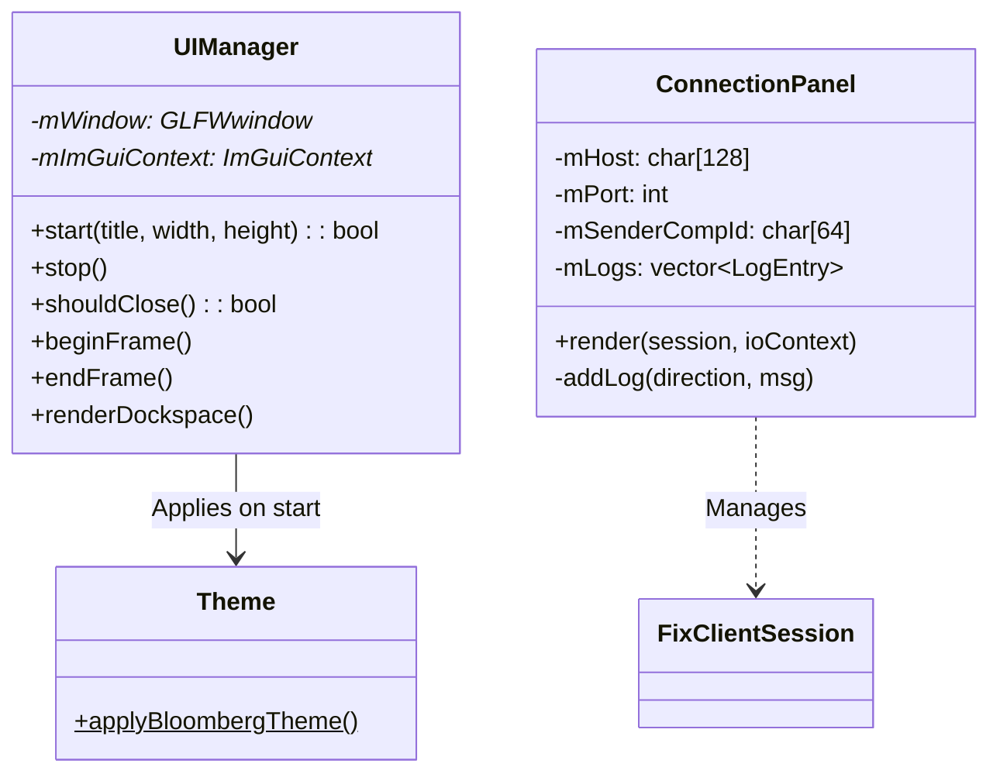

# Client | ImGui Trader Terminal

The `client_ui` module provides the interactive interface for BetaTrader. Built with **Dear ImGui** (docking branch) and **GLFW/OpenGL 3.3**, it manages window lifecycle, theming, and houses the GUI panels that visualize session and market state.

## Architecture

## Core Components

### 1. `UIManager`
RAII wrapper managing the full GLFW + ImGui + ImPlot lifecycle.
-   **Window Creation**: Creates a GLFW window with an OpenGL 3.3 Core Profile context.
-   **ImGui Bootstrap**: Initializes Dear ImGui context with Docking and Multi-Viewport support.
-   **Frame Lifecycle**: `beginFrame()` / `endFrame()` encapsulate polling, rendering, and buffer swaps.
-   **Dockspace**: `renderDockspace()` sets up a full-window docking area with a top menu bar.

### 2. `Theme`
Provides `applyBloombergTheme()`, a Bloomberg-terminal-inspired dark palette with orange accents for active/hovered elements. Sets consistent rounding, padding, and spacing across all ImGui widgets.

### 3. `ConnectionPanel`
ImGui panel for controlling the FIX client session lifecycle (previously in `client_fix`, moved here to keep the protocol library free of GUI dependencies).
-   **Session Config**: Host, port, SenderCompID, TargetCompID, heartbeat interval, and force-reset toggle.
-   **Lifecycle Buttons**: Connect, Logon (35=A), Logout (35=5), and Force Disconnect — buttons are state-aware (disabled when inappropriate).
-   **Status Indicator**: Color-coded session state display (Disconnected, Connecting, Connected, Logon Sent, Active, Logging Out).
-   **Message Log**: Scrollable, color-coded log of FIX messages with timestamps and auto-scroll support (capped at 500 entries).

## Planned Components

### `OrderbookModel`
The most critical data structure in the UI.
-   **Update Logic**: `Snapshot (35=W)` clears and bulk-loads; `Incremental (35=X)` applies granular updates.
-   **Performance**: Optimized for O(log N) updates and O(N) rendering by maintaining sorted bins.

### `MDSubscriptionManager`
Manages market data requirements with auto-resubscribe on reconnect.

### `UIEventQueue`
Thread-safe SPSC bridge between the async `client_fix` thread and the synchronous rendering loop.

## Setup & Dependencies
-   **Dear ImGui** (`docking` branch): Core GUI framework.
-   **ImPlot**: Extension for technical charting.
-   **GLFW/OpenGL 3.3**: Rendering backend (ImGui's built-in GL loader is used; no external GLAD/GL3W needed).
