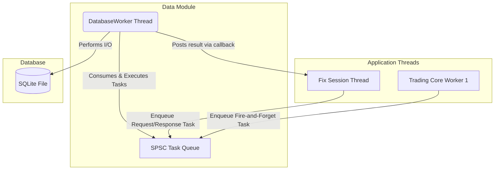
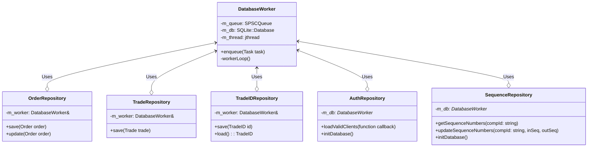

# Data Persistence Component

The Data module provides a persistence layer for the BetaTrader system.

## Overview

This module is responsible for asynchronously writing core business data, such as trades and orders, to a local SQLite database. It is designed to be a separate, non-blocking service that the `trading_core` can use for persistence without incurring I/O latency on its critical path. The architecture is built on an asynchronous worker pattern, where database operations are submitted to a queue and executed on a dedicated background thread.

## Architecture

The `data` module is designed around an **asynchronous worker pattern** to decouple high-performance trading logic from high-latency disk I/O.



## Class Diagram



## Component Responsibilities

| Component | Description |
| :--- | :--- |
| **`DatabaseWorker`** | Manages the database connection lifecycle and task-execution thread via a lock-free `SPSCQueue`. |
| **`OrderRepository`** | Encapsulates SQL logic for persisting and updating `common::Order` objects. |
| **`TradeRepository`** | Encapsulates SQL logic for inserting `common::Trade` objects. |
| **`TradeIDRepository`**| Manages a persistent, unique global trade ID counter. |
| **`AuthRepository`** | Handles asynchronous persistence and loading of authorized FIX client lists. |
| **`SequenceRepository`**| Persists FIX session sequence numbers for seamless connection recovery. |

## Lifecycle of a Save Request

1.  **Repository Call**: An application thread calls a repository method (e.g., `TradeRepository::save()`).
2.  **Task Creation**: The repository creates a lambda capturing the data and SQL logic.
3.  **Enqueue**: The task is pushed onto a lock-free `SPSCQueue`. The call returns immediately.
4.  **Consumption**: The `DatabaseWorker` thread dequeues and executes the task against the SQLite file.

## Database Schema

### `trades` Table
```sql
CREATE TABLE IF NOT EXISTS trades (
    trade_id          INTEGER PRIMARY KEY,
    symbol            TEXT NOT NULL,
    buy_order_id      INTEGER NOT NULL,
    sell_order_id     INTEGER NOT NULL,
    quantity          INTEGER NOT NULL,
    price             REAL NOT NULL,
    timestamp         INTEGER NOT NULL
);
```

### `orders` Table
```sql
CREATE TABLE IF NOT EXISTS orders (
    order_id          INTEGER PRIMARY KEY,
    client_id         INTEGER NOT NULL,
    symbol            TEXT NOT NULL,
    side              TEXT NOT NULL,
    type              TEXT NOT NULL,
    price             REAL NOT NULL,
    original_quantity INTEGER NOT NULL,
    remaining_quantity INTEGER NOT NULL,
    status            TEXT NOT NULL,
    timestamp         INTEGER NOT NULL
);
```

### `FIX_Sequences` Table
```sql
CREATE TABLE IF NOT EXISTS FIX_Sequences (
    compId            TEXT PRIMARY KEY NOT NULL,
    inSeqNum          INTEGER NOT NULL,
    outSeqNum         INTEGER NOT NULL
);
```

### `database_audit_log` Table
```sql
CREATE TABLE IF NOT EXISTS database_audit_log (
    log_id            INTEGER PRIMARY KEY AUTOINCREMENT,
    timestamp         INTEGER NOT NULL,
    action_type       TEXT NOT NULL CHECK(action_type IN ('INSERT', 'UPDATE', 'DELETE')),
    table_name        TEXT NOT NULL,
    record_id         INTEGER NOT NULL,
    details           TEXT
);
```
