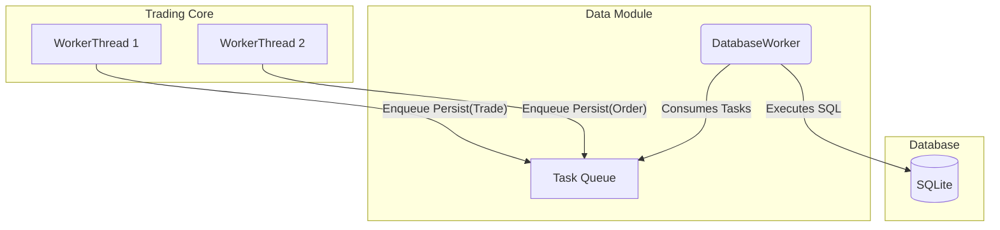

# Data Module (`core/data`)

This module contains the persistence layer for the BetaTrader system. It is responsible for asynchronously writing data, such as trades and orders, to a local SQLite database.

## Architecture: Asynchronous Worker Pattern

The `data` module is built around an **asynchronous worker pattern**. This design is essential for meeting the system's requirement that the core matching engine should never be blocked by I/O operations.

*   **`DatabaseWorker`**: A dedicated background thread that owns the connection to the SQLite database.
*   **Task Queue**: The `DatabaseWorker` consumes tasks from a lock-free SPSC (Single-Producer, Single-Consumer) queue.
*   **Asynchronous Submission**: Other threads (such as the `trading_core`'s `WorkerThread`) can enqueue tasks (packaged as C++ lambdas) to be executed by the `DatabaseWorker`.

This architecture ensures that all disk I/O is handled on a separate thread, allowing the `trading_core` to operate with minimal latency.



## Key Components

| Component | Description | Responsibilities |
| :--- | :--- | :--- |
| **`DatabaseWorker`** | The heart of the data module. It manages the task queue and the database connection. | Executes arbitrary database operations (packaged as lambdas) on a dedicated thread. |
| **`OrderRepository`** | A repository for persisting `common::Order` objects. | Provides methods to save and update orders in the database. |
| **`TradeRepository`** | A repository for persisting `common::Trade` objects. | Provides methods to save trades in the database. |
| **`TradeIDRepository`**| A repository for the global trade ID counter. | Ensures that trade IDs are unique and persistent across system restarts. |
| **`Query.h`** | A header file containing all the SQL statements used by the repositories. | Centralizes all SQL queries for easy management and review. |

## How to Use This Module

The `data` module is designed to be used by other components in the system, primarily the `trading_core`. The unit tests provide the best examples of how to interact with the repositories.

### Building and Running Tests

1.  Follow the build instructions in the main [README.md](../../README.md).
2.  Run the tests for this module:

```bash
# After building, from the build directory
./core/data/tests/DataTests
```

### Exploring the Code

*   **Test Files**: The test files in the `tests/` directory demonstrate how to use the repositories to save and retrieve data.
*   **Header Files**: The header files in `include/data/` provide the public interface for each component.
*   **TSD**: For a detailed technical breakdown, read the [Data TSD](./TSD.md).

## Database Schema

The database schema is intentionally simple and is defined implicitly by the `CREATE TABLE` statements in `Query.h`.

*   **`orders` table**: Stores the final state of all processed orders.
*   **`trades` table**: Stores all executed trades.
*   **`trade_id` table**: A simple key-value table to store the last used trade ID.

## Limitations and Future Work

*   **Manual Schema Migrations**: There is no automated schema migration framework. All schema changes must be managed manually.
*   **SQLite Only**: The current implementation is tightly coupled to SQLite. A future improvement would be to introduce a database abstraction layer to support other backends like PostgreSQL.
*   **Simple Repositories**: The repositories provide basic CRUD operations. More advanced query capabilities could be added as needed.
