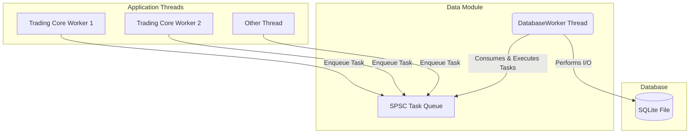

# Data Module: Technical System Design (TSD)

This document provides a detailed technical specification of the `core/data` module. It is intended for developers who want to understand the internal workings of the persistence layer, its threading model, and its database schema.

## 1. Architecture: Asynchronous Task Execution

The `data` module is designed around a simple yet powerful asynchronous task execution model. The goal is to decouple the high-performance `trading_core` from the high-latency world of disk I/O.

*   **`DatabaseWorker`**: The central component of this architecture. It runs on a dedicated background thread (`std::jthread`) and owns the sole `SQLite::Database` connection.
*   **SPSC Queue**: The `DatabaseWorker` consumes tasks from a `rigtorp::SPSCQueue`. This lock-free, single-producer, single-consumer queue is the conduit for all database operations.
*   **Task Submission**: Any thread in the application can act as a producer, enqueuing a task to be executed by the `DatabaseWorker`. A task is simply a `std::function<void(SQLite::Database&)>`, giving the caller full control over the database operation to be performed.



This design ensures that the calling threads never block on database operations, which is critical for the low-latency performance of the `trading_core`.

## 2. Component Responsibilities

| Component | Description |
| :--- | :--- |
| **`DatabaseWorker`** | Manages the lifecycle of the database connection and the task-execution thread. Its primary method is `enqueue()`, which submits a task to the queue. |
| **`OrderRepository`** | Provides a high-level API for persisting `common::Order` objects. It encapsulates the SQL logic for inserting and updating orders. |
| **`TradeRepository`** | Provides a high-level API for persisting `common::Trade` objects. It encapsulates the SQL logic for inserting trades. |
| **`TradeIDRepository`**| A specialized repository for managing the global trade ID counter. It ensures that trade IDs are unique and persist across application restarts. |
| **`Query.h`** | A centralized header file that contains all the raw SQL query strings used by the repositories. This makes the SQL easy to find, review, and manage. |

## 3. Database Schema

The database schema is defined by the `CREATE TABLE` statements found in `data::query`. It is designed to be simple and efficient for the system's current needs.

### `trades` Table
Stores a record of every executed trade.

```sql
CREATE TABLE IF NOT EXISTS trades (
    trade_id          INTEGER PRIMARY KEY,
    symbol            TEXT,
    buy_order_id      INTEGER,
    sell_order_id     INTEGER,
    quantity          INTEGER,
    price             REAL,
    timestamp         INTEGER
);
```

### `orders` Table
Stores the final state of every order that has been processed by the system.

```sql
CREATE TABLE IF NOT EXISTS orders (
    order_id          INTEGER PRIMARY KEY,
    client_id         INTEGER,
    symbol            TEXT,
    side              TEXT,
    type              TEXT,
    price             REAL,
    original_quantity INTEGER,
    remaining_quantity INTEGER,
    status            TEXT,
    timestamp         INTEGER
);
```

### `trade_id` Table
A simple single-row, single-column table used to persist the last used trade ID, ensuring uniqueness across restarts.

```sql
CREATE TABLE IF NOT EXISTS trade_id (
    id INTEGER PRIMARY KEY
);
```

## 4. Operational Notes

*   **Synchronous Operations**: While the design is fundamentally asynchronous, a caller can achieve synchronous behavior by wrapping the `enqueue` call in a `std::promise` and waiting on the associated `std::future`. This should be used sparingly to avoid blocking critical threads.
*   **Error Handling**: Errors that occur within a database task (e.g., SQL constraint violations) are currently logged by the `DatabaseWorker`. There is no mechanism to propagate these errors back to the original caller.
*   **Schema Migrations**: The system does not have an automated schema migration framework. Any changes to the schema must be managed manually.

## 5. Extending the Module

*   **Adding a New Entity**:
    1.  Add the necessary `CREATE TABLE` and DML query strings to `Query.h`.
    2.  Implement a new repository class (e.g., `MarketDataRepository`) following the existing pattern.
    3.  Add unit tests for the new repository in the `core/data/tests/` directory.
*   **Supporting a Different Database**:
    1.  Create a new `DatabaseWorker`-like component for the target database (e.g., `PostgresWorker`).
    2.  Implement the repository logic to enqueue tasks for the new worker.
    3.  Use a factory or dependency injection to provide the correct repositories to the `trading_core`.
