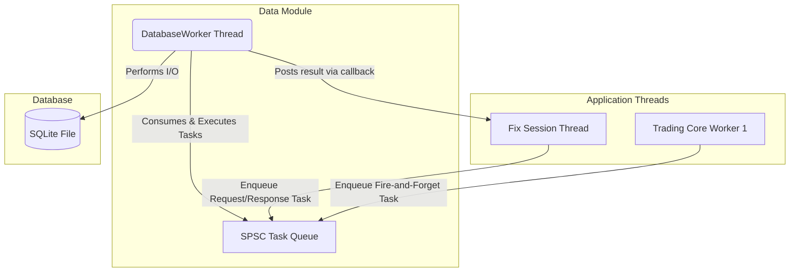
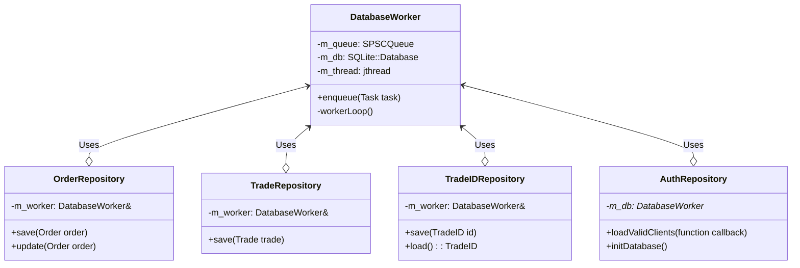

# Data Persistence Module Technical Specification
@page data_tsd Data Persistence Specification

This document provides a detailed technical specification of the `core/data` module.

## 1. Architecture

The `data` module is designed around an **asynchronous worker pattern**. The primary goal is to decouple the high-performance `trading_core` from high-latency disk I/O operations. All database writes are submitted to a lock-free queue and processed by a dedicated background thread.

### Key Characteristics:

*   **Asynchronous I/O**: The `trading_core` never blocks on database writes.
*   **Single Writer Thread**: A single `DatabaseWorker` thread owns the database connection, eliminating the need for complex locking.
*   **Task-Based Execution**: Operations are enqueued as `std::function` tasks, providing flexibility.
*   **Request/Response for Queries**: For operations that require a result (like authentication), a callback mechanism is used to return data to the calling thread without blocking.



## 2. Class Diagram

The following diagram illustrates the relationships between the key components in the `data` module.



## 3. Component Responsibilities

| Component | Description |
| :--- | :--- |
| **`DatabaseWorker`** | Manages the lifecycle of the database connection and the task-execution thread. Its primary method is `enqueue()`, which submits a task to the queue. |
| **`OrderRepository`** | Provides a high-level API for persisting `common::Order` objects. It encapsulates the SQL logic for inserting and updating orders. |
| **`TradeRepository`** | Provides a high-level API for persisting `common::Trade` objects. It encapsulates the SQL logic for inserting trades. |
| **`TradeIDRepository`**| A specialized repository for managing the global trade ID counter. It ensures that trade IDs are unique and persist across application restarts. |
| **`AuthRepository`** | Handles persistence for FIX client authentication lists. It initializes the `clients` table and provides asynchronous loading of valid SenderCompIDs. |
| **`Query.h`** | A centralized header file that contains all the raw SQL query strings used by the repositories. |

## 4. Lifecycle of a Save Request

This sequence describes how a `Trade` object from the `trading_core` is persisted to the database.

1.  **Initiation**: An application thread (e.g., in the `MatchingEngine`) has a new `common::Trade` object to persist.
2.  **Repository Call**: The thread calls `TradeRepository::save(myTrade)`. This call is non-blocking.
3.  **Task Creation**: The `TradeRepository` creates a `std::function` task (a lambda). This lambda captures the `Trade` data and contains the SQLite C++ calls needed to execute the `INSERT` statement defined in `data::query`.
4.  **Enqueue**: The repository calls `m_worker.enqueue(task)`, pushing the lambda onto the lock-free `SPSCQueue`. The function returns immediately, and the application thread continues its work.
5.  **Task Consumption**: The `DatabaseWorker`'s background thread is constantly polling the queue. It dequeues the task.
6.  **Execution**: The worker thread executes the task. This involves binding the `Trade` data to a prepared SQL statement and running it against the SQLite database file.
7.  **I/O Operation**: The actual disk write occurs on the `DatabaseWorker`'s thread, completely isolated from the application's critical path.

## 5. Database Schema

The schema is defined by `CREATE TABLE` statements in `data::query`.

### `trades` Table
*Stores a record of every matched trade.*
```sql
CREATE TABLE IF NOT EXISTS trades (
    trade_id          INTEGER PRIMARY KEY,
    symbol            TEXT NOT NULL,
    buy_order_id      INTEGER NOT NULL,
    sell_order_id     INTEGER NOT NULL,
    quantity          INTEGER NOT NULL,
    price             REAL NOT NULL,
    timestamp         INTEGER NOT NULL
);
```

### `orders` Table
*Maintains the state of all orders in the system.*
```sql
CREATE TABLE IF NOT EXISTS orders (
    order_id          INTEGER PRIMARY KEY,
    client_id         INTEGER NOT NULL,
    symbol            TEXT NOT NULL,
    side              TEXT NOT NULL,
    type              TEXT NOT NULL,
    price             REAL NOT NULL,
    original_quantity INTEGER NOT NULL,
    remaining_quantity INTEGER NOT NULL,
    status            TEXT NOT NULL,
    timestamp         INTEGER NOT NULL
);
```

### `trade_id` Table
*A persistent, singleton counter for generating unique trade IDs.*
```sql
CREATE TABLE IF NOT EXISTS trade_id (
    id INTEGER PRIMARY KEY
);
```

### `clients` Table
*Stores authorized FIX clients.*
```sql
CREATE TABLE IF NOT EXISTS clients (
    client_id         TEXT PRIMARY KEY,
    is_active         INTEGER NOT NULL CHECK(is_active IN (0, 1))
);
```

### `database_audit_log` Table
*Provides a detailed audit trail of all changes to business-critical tables.*
```sql
CREATE TABLE IF NOT EXISTS database_audit_log (
    log_id            INTEGER PRIMARY KEY AUTOINCREMENT,
    timestamp         INTEGER NOT NULL,
    action_type       TEXT NOT NULL CHECK(action_type IN ('INSERT', 'UPDATE', 'DELETE')),
    table_name        TEXT NOT NULL,
    record_id         INTEGER NOT NULL,
    details           TEXT
);
```
