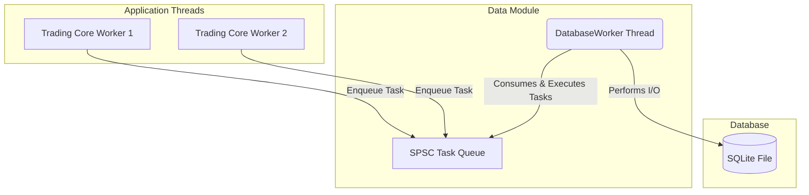
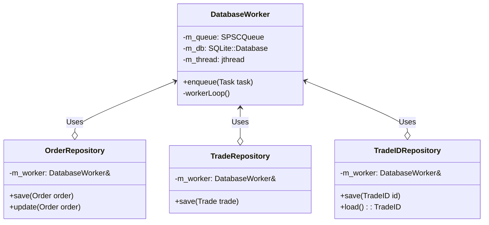

# Data Module: Technical System Design (TSD)

This document provides a detailed technical specification of the `core/data` module.

## 1. Architecture

The `data` module is designed around an **asynchronous worker pattern**. The primary goal is to decouple the high-performance `trading_core` from high-latency disk I/O operations. All database writes are submitted to a lock-free queue and processed by a dedicated background thread.

### Key Characteristics:

*   **Asynchronous I/O**: The `trading_core` never blocks on database writes.
*   **Single Writer Thread**: A single `DatabaseWorker` thread owns the database connection, eliminating the need for complex locking.
*   **Task-Based Execution**: Operations are enqueued as `std::function` tasks, providing flexibility.



## 2. Class Diagram

The following diagram illustrates the relationships between the key components in the `data` module.



## 3. Component Responsibilities

| Component | Description |
| :--- | :--- |
| **`DatabaseWorker`** | Manages the lifecycle of the database connection and the task-execution thread. Its primary method is `enqueue()`, which submits a task to the queue. |
| **`OrderRepository`** | Provides a high-level API for persisting `common::Order` objects. It encapsulates the SQL logic for inserting and updating orders. |
| **`TradeRepository`** | Provides a high-level API for persisting `common::Trade` objects. It encapsulates the SQL logic for inserting trades. |
| **`TradeIDRepository`**| A specialized repository for managing the global trade ID counter. It ensures that trade IDs are unique and persist across application restarts. |
| **`Query.h`** | A centralized header file that contains all the raw SQL query strings used by the repositories. This makes the SQL easy to find, review, and manage. |

## 4. Database Schema

The schema is defined by `CREATE TABLE` statements in `data::query`.

### `trades` Table
```sql
CREATE TABLE IF NOT EXISTS trades (
    trade_id          INTEGER PRIMARY KEY,
    symbol            TEXT,
    buy_order_id      INTEGER,
    sell_order_id     INTEGER,
    quantity          INTEGER,
    price             REAL,
    timestamp         INTEGER
);
```

### `orders` Table
```sql
CREATE TABLE IF NOT EXISTS orders (
    order_id          INTEGER PRIMARY KEY,
    client_id         INTEGER,
    symbol            TEXT,
    side              TEXT,
    type              TEXT,
    price             REAL,
    original_quantity INTEGER,
    remaining_quantity INTEGER,
    status            TEXT,
    timestamp         INTEGER
);
```

### `trade_id` Table
```sql
CREATE TABLE IF NOT EXISTS trade_id (
    id INTEGER PRIMARY KEY
);
```
