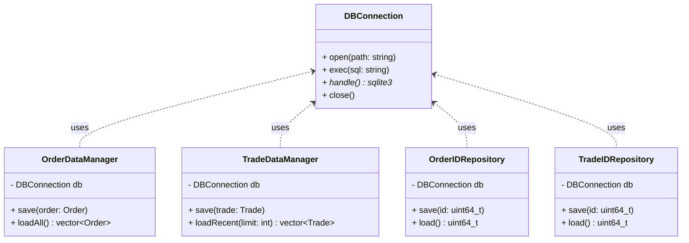

#  core/data

---

## 1. Purpose

`trading_core/data` provides minimal data persistence utilities for the BetaTrader engine.
Each component is a small, self-contained manager that directly interacts with SQLite (or any simple backend).
No hierarchies. No polymorphic adapters. Each manager does one thing well.

---

## 2. Design Principles

* **Flat layout:** no inheritance trees, no base interfaces.
* **Explicit coupling:** each manager knows what it stores.
* **SQLite-first:** default backend is SQLite; others can be added later as separate files.
* **Stateless API surface:** each class owns its own connection handle and manages commits locally.
* **Composable:** add a new `*Repository` or `*Manager` file for new data types.

---

## 3. Components

### 3.1 `DBConnection`

* Lightweight wrapper around a SQLite handle.
* Provides:

  ```cpp
  void open(const std::string& path);
  void exec(const std::string& sql);
  sqlite3* handle();
  void close();
  ```
* Used by all managers.

---

### 3.2 `OrderDataManager`

* Handles persistence of `Order` records.
* Responsibilities:

    * Create and maintain `orders` table.
    * Insert, update, and query orders.
* Example:

  ```cpp
  void save(const Order& order);
  std::vector<Order> loadAll();
  ```

---

### 3.3 `TradeDataManager`

* Manages trade persistence.
* Functions:

  ```cpp
  void save(const Trade& trade);
  std::vector<Trade> loadRecent(int limit);
  ```

---

### 3.4 `OrderIDRepository`

* Stores and retrieves the current order ID counter.
* Schema: `state(key TEXT PRIMARY KEY, value INTEGER)`
* Example:

  ```cpp
  void save(uint64_t id);
  uint64_t load();
  ```

---

### 3.5 `TradeIDRepository`

* Identical to `OrderIDRepository`, but for trade IDs.
* Separate key in the same `state` table or its own table.

---

## 4. Class Diagram



---

## 5. Schema

```sql
CREATE TABLE IF NOT EXISTS orders (
    id INTEGER PRIMARY KEY,
    ticker TEXT,
    client_id TEXT,
    side INTEGER,
    type INTEGER,
    quantity REAL,
    price REAL,
    status INTEGER,
    timestamp DATETIME
);

CREATE TABLE IF NOT EXISTS trades (
    id INTEGER PRIMARY KEY,
    buy_order_id INTEGER,
    sell_order_id INTEGER,
    price REAL,
    quantity REAL,
    timestamp DATETIME
);

CREATE TABLE IF NOT EXISTS state (
    key TEXT PRIMARY KEY,
    value INTEGER
);
```

---

## 6. Example Usage

```cpp
DBConnection db;
db.open("beta_trader.db");

OrderDataManager orderMgr(db);
TradeDataManager tradeMgr(db);
OrderIDRepository orderIdRepo(db);
TradeIDRepository tradeIdRepo(db);

// Save trade
Trade t{1, 1001, 1002, 99.5, 100};
tradeMgr.save(t);

// Update trade ID counter
tradeIdRepo.save(12345);
```

---

## 7. Notes

* Each class is a **standalone** component.
* Adding new data? Just make a new manager file, e.g., `PositionDataManager`.
* No inheritance. No shared abstract base.
* DB connection can be shared or passed as needed.
* Keeps system simple, readable, and composable.
