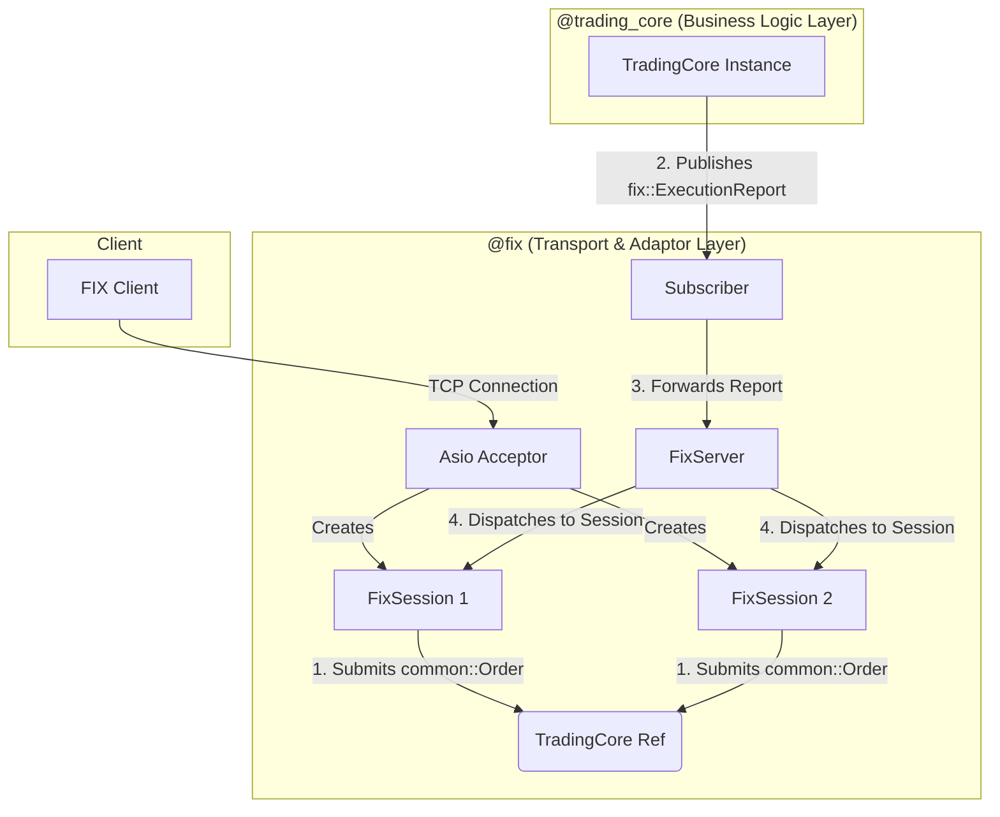

# Technical Specification Document: FIX Server (`@fix`)

## 1. Overview

The `@fix` component is a standalone server that acts as the primary gateway for FIX-based clients to interact with the BetaTrader trading engine. It is responsible for managing the entire lifecycle of a client connection, from accepting the initial TCP connection to translating messages between the FIX protocol and the application's internal domain.

The server is built for high performance and low latency, using the Asio library for all network I/O. It follows a decoupled, asynchronous architecture to ensure that network operations do not block the critical path of the trading core.

## 2. Architecture

The system is designed with a clear separation of concerns between the transport layer (`@fix`) and the business logic layer (`@trading_core`). Communication between these two layers is achieved via a publisher-subscriber pattern.

### Key Components

*   **`FixServer`**: The top-level server class. It owns the Asio `acceptor` and a map of all active client sessions, indexed by a unique `SessionID`. Its primary role is to accept new connections and act as a dispatcher for outbound execution reports.
*   **`FixSession`**: Represents a single connected client. It owns the Asio `socket` and is responsible for the asynchronous read loop. When a complete FIX message is received, it uses `BinaryToOrderRequestConverter` to parse it, creates a `common::Order`, and submits it to the `TradingCore`.
*   **`TradingCore` (Singleton)**: The central trading engine. It exposes a `subscribeToExecutions` method that allows components like the `FixServer` to listen for business events.
*   **`ExecutionPublisher`**: A static utility class within the `@trading_core`. This is the **factory for `fix::ExecutionReport` objects**. When a business event occurs (e.g., an order is accepted, filled, or cancelled), this class is responsible for constructing the complete, protocol-compliant `fix::ExecutionReport`.
*   **Subscriber (`main`)**: The entry point of the `fix_server` executable acts as the "glue". It creates the `TradingCore` and `FixServer` instances and then subscribes to the `TradingCore`'s execution report stream, providing a lambda that forwards the reports to the `FixServer` for dispatching.

## 3. Order Lifecycle: New Order -> Acknowledged -> Filled

This sequence demonstrates the clean separation of concerns.

1.  **New Order In**: A client sends a `New Order Single` (35=D) message. The `FixSession`'s `doRead` handler receives the data.
2.  **Submission to Core**: The `FixSession` parses the message, creates a `common::Order` object, and calls `mTradingCore.submitCommand(...)`. The `FixSession` immediately returns to its read loop, waiting for the next message. It does **not** wait for a response.
3.  **Core Acknowledgment**: The `TradingCore` processes the `NewOrder` command, assigns a permanent `OrderID`, and calls `ExecutionPublisher::publishExecution(order, "NEW")`.
4.  **Report Creation**: The `ExecutionPublisher` creates a complete `fix::ExecutionReport` with `OrdStatus=New` (0) and all other required fields (OrderID, prices, quantities, etc.).
5.  **Publication**: The `ExecutionPublisher` invokes the callback provided by the subscriber in `fix/main.cpp`, passing the newly created `ExecutionReport`.
6.  **Dispatch**: The subscriber lambda calls `server.onExecutionReport(report)`. The `FixServer` looks up the session ID from `report.getTargetCompId()` and calls `session->sendExecutionReport(report)`.
7.  **Transport**: The `FixSession` serializes the report into a binary FIX message and writes it to the client's socket.
8.  **Matching & Filling**: Later, the `MatchingEngine` processes the order and generates a fill. It calls `ExecutionPublisher::publishTrade(...)` (or `publishExecution` with a "FILL" action).
9.  **Fill Publication**: Steps 4-7 are repeated, but this time the `ExecutionPublisher` creates a report with `OrdStatus=Filled` (2) or `PartiallyFilled` (1), including the `LastPx` and `LastQty` of the trade. This second report is sent to the client.

## 4. Future Enhancements

This architecture provides a solid foundation. The following are the next logical steps to create a production-ready FIX gateway.

*   **Full Session Management (Logon/Logout)**:
    *   Implement the FIX Logon (35=A) and Logout (35=5) message flows.
    *   The server should not accept application-level messages (like orders) before a successful logon.
    *   Implement heartbeat messages (35=0) to detect and manage stale connections.
    *   The `SenderCompID` and `TargetCompID` from the Logon message should be used for session identification instead of the current internal counter.

*   **Message Sequencing and Recovery**:
    *   Each `FixSession` must manage incoming and outgoing message sequence numbers (Tag 34).
    *   The server must validate the sequence number of every incoming message and be able to send a `Resend Request` (35=2) if a gap is detected.
    *   Persist outgoing messages to allow for recovery in case of a disconnect.

*   **Order Management Messages**:
    *   Implement `Order Cancel Request` (35=F) and `Order Cancel/Replace Request` (35=G).
    *   This involves creating new `Command` types in the `@trading_core` and handling the corresponding `ExecutionReport` statuses (e.g., `Cancelled`, `Replaced`).

*   **Error Handling and Rejection**:
    *   Implement `Reject` (35=3) messages for session-level errors (e.g., invalid tag, malformed message).
    *   Implement `Business Message Reject` (35=j) for application-level errors that are valid FIX but violate business rules.
    *   The `ExecutionPublisher::publishRejection` method should be updated to create a proper `ExecutionReport` with `OrdStatus=Rejected` (8).

*   **Configuration**:
    *   Externalize settings like the listening port, server CompID, and logging levels into a configuration file instead of being hardcoded.
