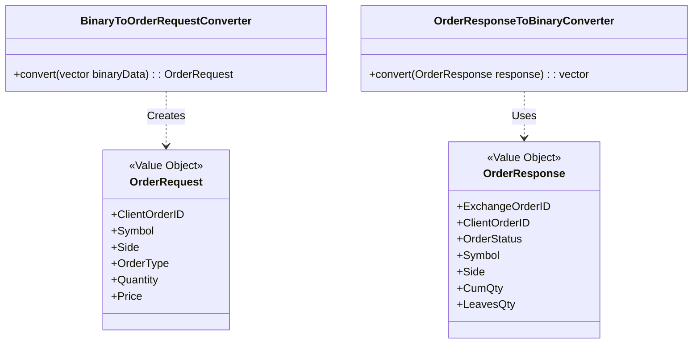

# Technical Specification Document: FIX Protocol Library

This document outlines the technical details of the FIX protocol library (`@fix`).

## 1. Overview

The library's primary responsibility is to handle the serialization and deserialization of FIX messages, specifically for `OrderRequest` (New Order - Single, `35=D`) and `OrderResponse` (Execution Report, `35=8`). It acts as a bridge between the external FIX protocol and the application's internal C++ types.

## 2. Class Diagram

## 3. Message Formats

The library supports the following FIX message formats. The `SOH` character (`\x01`) is used as the field delimiter.

### 3.1. New Order - Single (`35=D`) -> `OrderRequest`

| Tag | Field Name        | C++ Type                | Notes                               |
|-----|-------------------|-------------------------|-------------------------------------|
| 11  | ClientOrderID     | `fix::ClientOrderID`    |                                     |
| 55  | Symbol            | `fix::Symbol`           |                                     |
| 54  | Side              | `common::OrderSide`     | `1`=Buy, `2`=Sell                   |
| 40  | OrdType           | `common::OrderType`     | `1`=Market, `2`=Limit               |
| 38  | OrderQty          | `fix::Quantity`         |                                     |
| 44  | Price             | `fix::Price`            | Required for Limit orders           |

### 3.2. `OrderResponse` -> Execution Report (`35=8`)

| Tag | Field Name        | C++ Type                | Notes                               |
|-----|-------------------|-------------------------|-------------------------------------|
| 37  | ExchangeOrderID   | `fix::ExchangeOrderID`  |                                     |
| 11  | ClientOrderID     | `fix::ClientOrderID`    |                                     |
| 39  | OrderStatus       | `common::OrderStatus`   | `0`=New, `1`=PartiallyFilled, etc.  |
| 55  | Symbol            | `fix::Symbol`           |                                     |
| 54  | Side              | `common::OrderSide`     | `1`=Buy, `2`=Sell                   |
| 14  | CumQty            | `fix::Quantity`         |                                     |
| 151 | LeavesQty         | `fix::Quantity`         |                                     |
| 31  | LastPrice         | `fix::Price`            |                                     |
| 32  | LastQty           | `fix::Quantity`         |                                     |

*(Note: Common header/trailer fields like `BeginString`, `BodyLength`, `MsgType`, and `CheckSum` are handled by the converters but omitted here for brevity.)*

## 4. Implementation Details

### 4.1. Deserialization (`BinaryToOrderRequestConverter`)

1.  **Validation**: The converter first validates the message's checksum and body length.
2.  **Tokenization**: The raw message is split by the `SOH` delimiter into a `std::map<int, std::string_view>` for efficient tag lookup.
3.  **Population**: The map is used to populate the `OrderRequest` object, with helper functions converting string views to the appropriate C++ types.

### 4.2. Serialization (`OrderResponseToBinaryConverter`)

1.  **Body Construction**: A `std::stringstream` is used to build the message body first, which allows for calculating the body length.
2.  **Header Construction**: The header is then built, including the calculated body length.
3.  **Checksum Calculation**: The checksum is calculated over the header and body.
4.  **Final Assembly**: The header, body, and checksum are combined to form the final FIX message.
