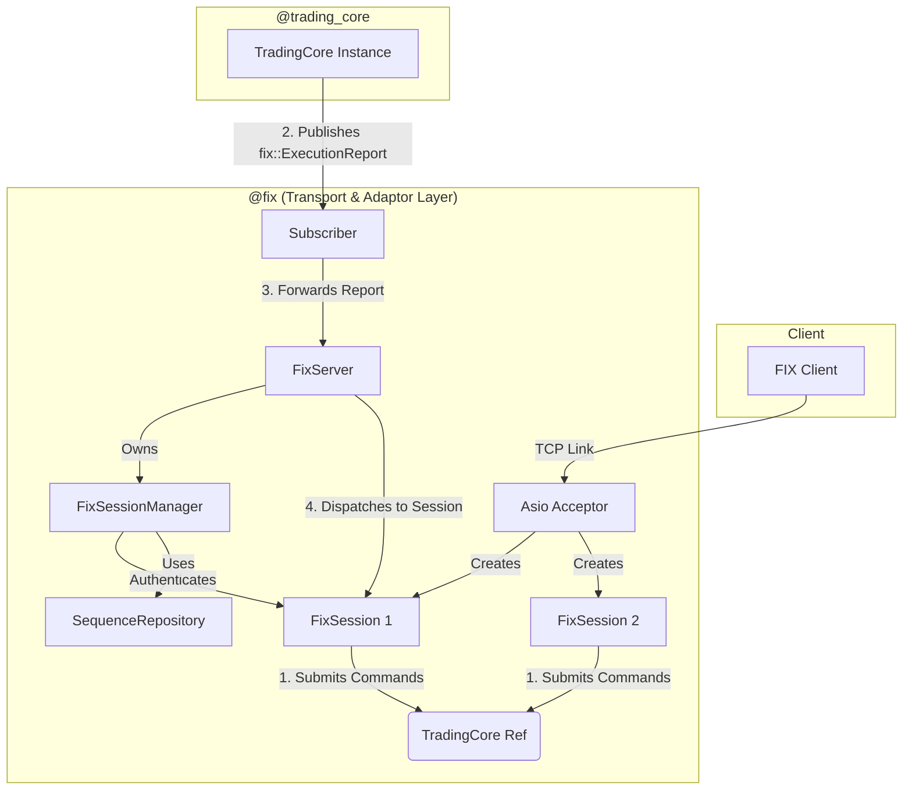

# FIX Gateway Technical Specification

## 1. Overview

The `@fix` component is a standalone server that acts as the primary gateway for FIX-based clients to interact with the BetaTrader trading engine. It is responsible for managing the entire lifecycle of a client connection, from accepting the initial TCP connection to translating messages between the FIX protocol and the application's internal domain.

The server is built for high performance and low latency, using the Asio library for all network I/O. It follows a decoupled, asynchronous architecture to ensure that network operations do not block the critical path of the trading core.

## 2. Architecture

The system is designed with a clear separation of concerns between the transport layer (`@fix`) and the business logic layer (`@trading_core`). Communication between these two layers is achieved via a publisher-subscriber pattern.

### Key Components

*   **`FixServer`**: The top-level server class. It owns the Asio `acceptor`, the `FixSessionManager`, and a map of active sessions.
*   **`FixSession`**: Represents a single connected client. Handles the async read/write loop and state transitions.
*   **`FixSessionManager`**: Manages session state (LoggedOn, sequence numbers) and performs authentication against the list of authorized clients.
*   **`OutboundMessageBuilder`**: Centralized utility for constructing the binary FIX strings. It handles `BodyLength` (9) and `Checksum` (10) calculation and provides templates for Logon, Logout, Heartbeat, and ResendRequest.
*   **`BinaryTo...Converter`**: Specialized parsers that translate binary FIX messages into strongly-typed internal request objects.

## 3. Session Management & Order Lifecycle

### 3.1 Session Lifecycle (NEW)
1.  **Connection**: Client connects via TCP. A `FixSession` is created in an `Unauthenticated` state.
2.  **Logon (35=A)**: Client must send a Logon message. `FixSession` parses it and calls `FixSessionManager::authenticate()`. 
3.  **Authentication & Recovery**: `FixSessionManager` checks the `SenderCompID` against a list of valid clients. It also queries the `SequenceRepository` to recover the last known `inSeqNum` and `outSeqNum` for seamless connection resumption.
4.  **Acceptance**: If valid, the session is marked `LoggedOn`, and a Logon Ack is sent back.
5.  **Sequencing**: Every subsequent message must have a valid `MsgSeqNum` (34). `FixSessionManager` detects gaps, fatal sequence errors, and persists the updated sequence numbers back to the `SequenceRepository`.

### 3.2 Order Lifecycle (New Order, Cancel, Modify)
[... existing content for 35=D, F, G remains valid ...]

## 4. Future Enhancements

*   **Heartbeat Management**: Automatically send TestRequests if no activity is detected within the HeartBtInt.
*   **Business Message Reject (35=j)**: Handle application-level rejections more gracefully.
