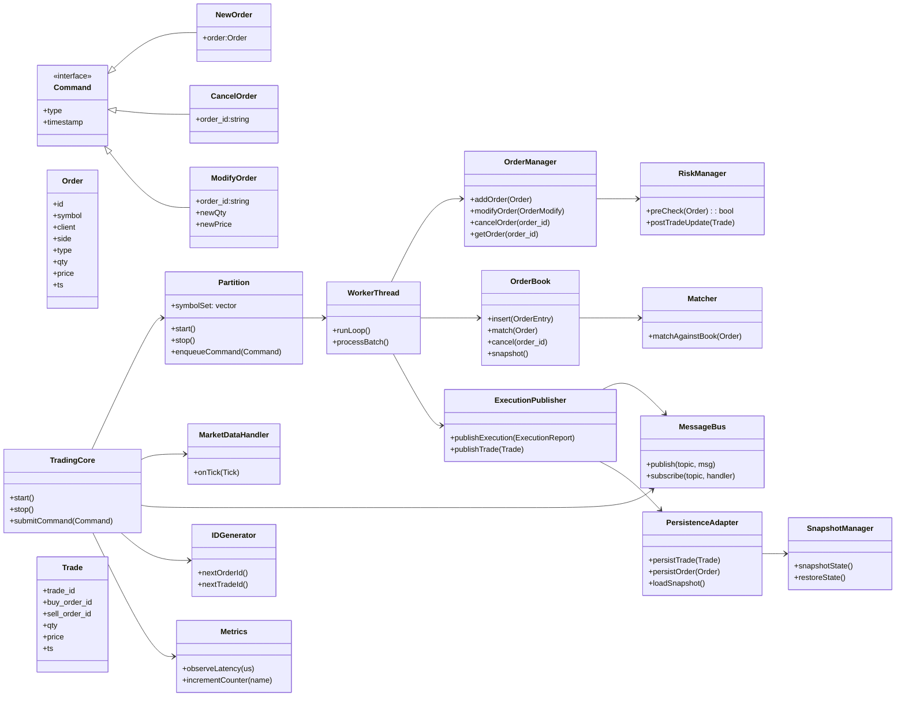

# Trading Core — TSD

## 1 — High-level design patterns

* **Reactor / Event Loop** — single-threaded event loop per instrument partition.
* **Command / Message Bus** — commands (NewOrder, Cancel, Modify) are commands processed by OrderManager.
* **Publisher-Subscriber** — pub/sub for outbound events (ZeroMQ).
* **Partitioned Single-Writer** — one writer thread per instrument partition (no locks inside core matching path).
* **Asynchronous IO** — persistence and external comms async to matching thread.

---

## 2 — Class diagram (Mermaid)

---

## 3 — Class responsibilities

* **TradingCore**

    * Bootstrap partitions, IO, message bus, adapters, metrics.
    * Entry point for external commands.
* **Partition**

    * Owns a set of instruments.
    * Single-writer WorkerThread for owned instruments.
    * Provides SPSC command queue for producers (gateways).
* **WorkerThread**

    * Reads command queue in batches.
    * Runs deterministic event loop: risk → match → update → publish.
* **OrderManager**

    * Indexes orders by id.
    * Fast lookup for cancels/modifies.
* **OrderBook**

    * Price-level maps to deques.
    * Efficient top-of-book and matching operations.
* **Matcher**

    * Implements matching algorithm.
    * Ensures price-time priority and partial fills semantics.
* **RiskManager**

    * Pre-trade and per-trade checks.
    * Stateless checks kept fast; heavier checks deferred async if possible.
* **ExecutionPublisher**

    * Formats and pushes ExecutionReports/TradeEvents to MessageBus and PersistenceAdapter.
    * Non-blocking handoff (lock-free queue) to IO workers.
* **MessageBus**

    * ZeroMQ adapter. PUB/SUB and optional persistent seqs.
* **PersistenceAdapter**

    * Async writer threads to Redis/TimescaleDB.
    * Ensures write-ahead logs or durable event storage.
* **SnapshotManager**

    * Periodic snapshots of open orders and positions to Redis.
    * On startup restores state atomically.
* **MarketDataHandler**

    * Translates external ticks into internal reference prices; may trigger crossing logic or mid-price checks.
* **IDGenerator**

    * High-throughput, monotonic ID generator (timestamp+counter).
* **Metrics**

    * Low-overhead histograms and counters.

---

## 4 — Threading & concurrency model

1. **Gateway / API threads**: parse external protocols and push `Command` objects into partitions' SPSC queues.

    * Multiple producers allowed. Use multi-producer ring buffers or a fan-in lock-free queue.
2. **Partition Worker (single writer)**: only thread that mutates that partition's OrderBook and OrderManager.

    * No fine-grained locks needed inside matching path.
3. **IO / Persistence worker pool**: consume outbound event queues (trades, exec reports) and perform network/DB writes asynchronously.
4. **Admin / Metrics thread**: samplers and health checks.

Implementation notes:

* Use **SPSC ring buffer** per gateway→partition path if you can bound producers; otherwise use **MPMC** with batching.
* Use `std::atomic` for sequence numbers.
* Use **memory barriers** and `std::atomic_thread_fence` only where necessary.
* For object lifecycle, use epoch-based reclamation or hazard pointers for lock-free deletion.

---

## 5 — Internal queues & batching

* **Command Queue** (gateway → partition): ring buffer of `Command*` or small POD command structs. Batch size tunable (e.g., 64).
* **Outbound Event Queue** (partition → IO): lock-free queue (MPMC) holding serialized FlatBuffer blobs. IO workers drain asynchronously.
* **Snapshot Channel**: low-traffic, durable writes.

Batch processing:

* Worker reads N commands or until empty, processes as atomic batch to reduce syscall and context switches.
* Publish events in batch to MessageBus to amortize ZeroMQ sends.

---

## 6 — Matching rules & determinism

* Matching is **price-time**:

    * Better price first.
    * If same price, earlier timestamp first.
* Execution price: resting order’s price (common exchange convention).
* Partial fills allowed; update remaining order and continue matching.
* Determinism:

    * Timestamps should come from a single monotonic clock or assigned at ingestion to avoid ordering variance.
    * Worker processes commands serially to preserve determinism.

---

## 7 — Serialization & wire protocol

* Use FlatBuffers for low-copy serialization.
* On publish, produce ready-to-send buffer and hand it to IO workers.
* Message envelope: `{topic, sequence, timestamp, payload}`.
* Maintain per-topic sequence numbers persisted at intervals.

---

## 8 — Persistence & recovery

* **Warm state**: Redis store of open orders and positions. SnapshotManager writes compact snapshot every X seconds or N trades.
* **Cold state**: TimescaleDB append-only of trades and order lifecycle for audit/backtest.
* On restart:

    1. Load Redis snapshot.
    2. Restore sequence numbers.
    3. Rebuild index structures.
    4. Accept incoming commands only after state restored.

Guarantees:

* If PersistenceAdapter uses write-ahead logs, you can achieve at-least-once durability. Use unique trade IDs and idempotency at consumers to avoid duplication.

---

## 9 — Performance tuning checklist

* Partition instruments by load to keep single-writer path light.
* Avoid heap allocation on hot path. Use object pools or arena allocators.
* Inline hot functions, minimize virtual calls in matching inner loop.
* Use cache-aware data structures for price levels.
* Measure GC/allocator stalls; prefer custom allocators for OrderEntry objects.
* Use lock-free queues; avoid mutexes in hot path.

---

## 10 — APIs and admin

* Admin endpoints:

    * `POST /admin/dump_book?symbol=XXX`
    * `POST /admin/cancel_all?client=YYY`
    * `GET /admin/health`
* Control channel accepts `Command` objects for backfill, replay, and recovery control.

---

## 11 — Example sequence (concise)

1. Gateway parses FIX → creates `NewOrder` command with ts and pushes to partition queue.
2. Partition Worker dequeues, calls `RiskManager.preCheck`.
3. If pass: `OrderManager.addOrder` → `OrderBook.insert` → `Matcher.match` (may produce Trade(s)).
4. For each Trade:

    * Apply updates to positions.
    * Create Trade object, push to outbound queue.
    * Enqueue ExecutionReport.
5. Worker loops. IO workers flush outbound queues to ZeroMQ/DB.

