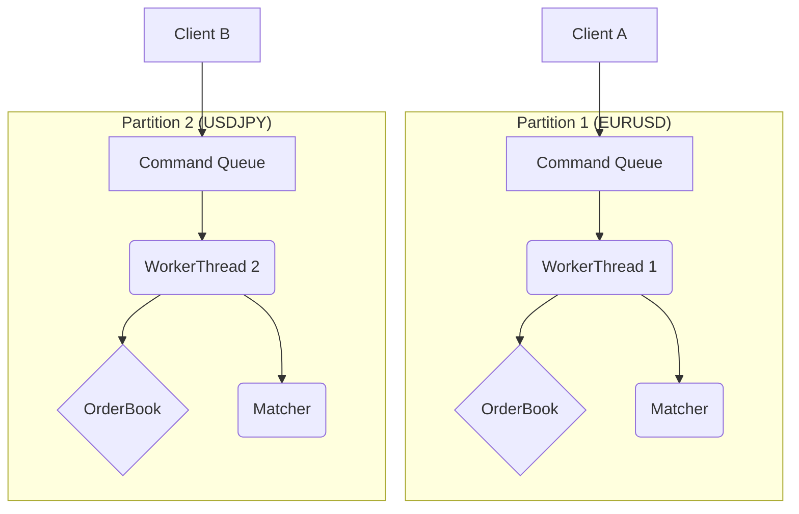
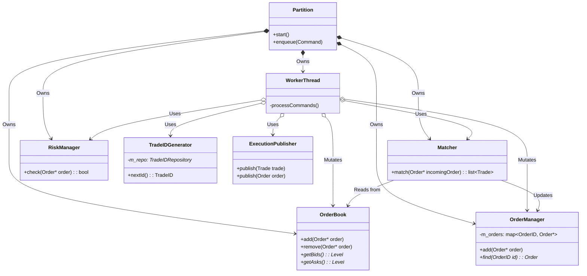

# Core | Matching Engine & Order Management

The Trading Core is the in-memory matching engine and order management system for BetaTrader.

## Overview

This module is the heart of the trading system. It is responsible for managing the entire lifecycle of an order: receiving it, validating it against risk limits, matching it against other orders, and publishing the resulting executions. The architecture is designed for low-latency, high-throughput, and deterministic processing by partitioning instruments across single-threaded, lock-free workers.

## Key Responsibilities

*   Manage order state and provide fast lookups.
*   Implement a price-time priority matching algorithm.
*   Maintain an order book for each instrument.
*   Perform pre-trade risk checks.
*   Publish execution reports (trades and order status updates).
*   Generate unique order and trade identifiers.

## Architecture

The `trading_core` is built on a **partitioned, single-writer** architecture for low latency and high throughput.

## Class Diagram

## Component Responsibilities

| Component | Description |
| :--- | :--- |
| **`Partition`** | A logical unit of processing for a set of instruments. Owns the `WorkerThread` and its command queue. |
| **`TradingCore`** | The top-level singleton entry point. Manages the lifecycle of partitions and provides the public API. |
| **`WorkerThread`** | A dedicated thread for a single partition. Dequeues and processes commands sequentially. |
| **`OrderBook`** | A data structure that stores resting limit orders, sorted by price and time. |
| **`OrderManager`** | A repository for all live orders within a partition. It owns the `Order` objects. |
| **`Matcher`** | Implements the price-time priority matching algorithm to produce trades. |
| **`RiskManager`** | Validates incoming orders against configurable risk limits. |
| **`TradeIDGenerator`**| Thread-safe generator for `TradeIDs`, persisting sequence asynchronously via `data`. |
| **`ExecutionPublisher`** | Distributes execution reports (trades and order status updates) to standard output. |

## Critical Design Conventions

-   **Ownership**: The `OrderManager` is the sole owner of all `Order` objects.
-   **No Blocking I/O**: The `WorkerThread` must not perform blocking I/O. Persistence is delegated to the `data` module.
-   **Zero Allocations**: The critical path avoids heap allocations and uses lock-free structures.
