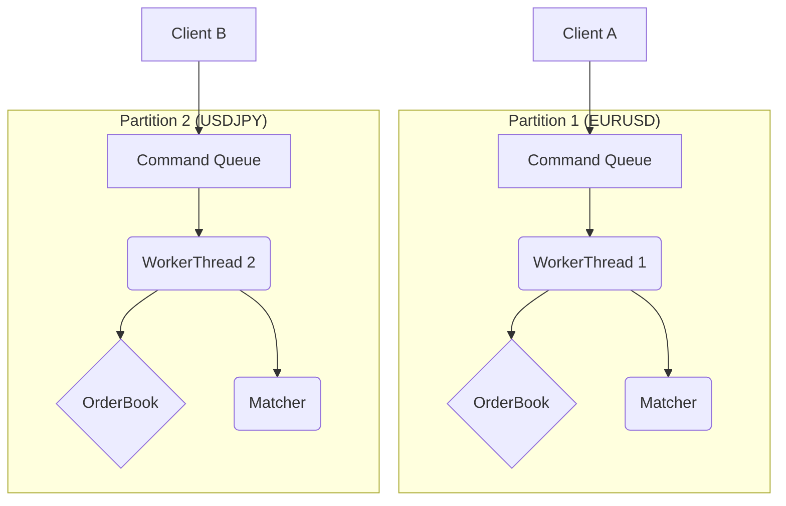
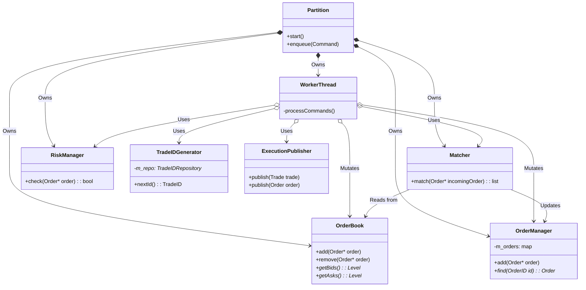

# Trading Core: Technical System Design (TSD)

This document provides a detailed technical specification of the `core/trading_core` module.

## 1. Architecture

The `trading_core` is built on a **partitioned, single-writer** architecture. This design is crucial for achieving low latency and high throughput while ensuring deterministic behavior.

*   **Partitioning**: The system is divided into multiple `Partitions`, with each partition responsible for a specific set of instruments (e.g., `EURUSD`). This allows for concurrent processing of different instruments.
*   **Single Writer**: Each `Partition` has a dedicated `WorkerThread` that processes commands sequentially from a lock-free SPSC queue. This thread is the **only writer** for that partition's state (e.g., its order book), which eliminates the need for locks on the critical path.

## 2. Class Diagram

The following diagram shows the high-level relationships between the key components within a single partition.

## 3. Component Responsibilities

| Component | Description |
| :--- | :--- |
| **`Partition`** | A logical unit of processing for a set of instruments. Owns the `WorkerThread` and its command queue. |
| **`TradingCore`** | The top-level singleton entry point. Manages the lifecycle of partitions and provides the public API. It also owns the **`AuthRepository`** for client authentication. |
| **`WorkerThread`** | A dedicated thread for a single partition. Dequeues and processes commands sequentially. |
| **`OrderBook`** | A data structure that stores resting limit orders, sorted by price and time for a single instrument. |
| **`OrderManager`** | A repository for all live orders within a partition. It owns the `Order` objects and provides fast lookups by Order ID. |
| **`Matcher`** | The core matching engine. It implements the price-time priority matching algorithm and produces trades when an incoming order crosses the book. |
| **`RiskManager`** | A component for pre-trade risk checks. It validates incoming orders against configurable risk limits. |
| **`TradeIDGenerator`**| Thread-safe generator for `TradeIDs`. Depends strictly on the `TradeIDRepository` interface for fetching and persisting the sequence asynchronously. |
| **`ExecutionPublisher`** | An interface for distributing execution reports (trades and order status updates). It now logs structured strings to standard output in real-time. |

## 4. Critical Design Conventions

*   **Ownership**: The `OrderManager` is the sole owner of all `Order` objects. Other components operate on raw pointers to these objects for performance, with clear ownership semantics to prevent memory errors.
*   **No Blocking I/O**: The `WorkerThread` and all components it calls directly **must not** perform blocking I/O. All persistence is delegated to the `data` module via an asynchronous queue.
*   **Performance**: The critical path (the `WorkerThread`'s command processing loop) is highly optimized. It avoids heap allocations where possible and uses lock-free data structures for inter-thread communication.
