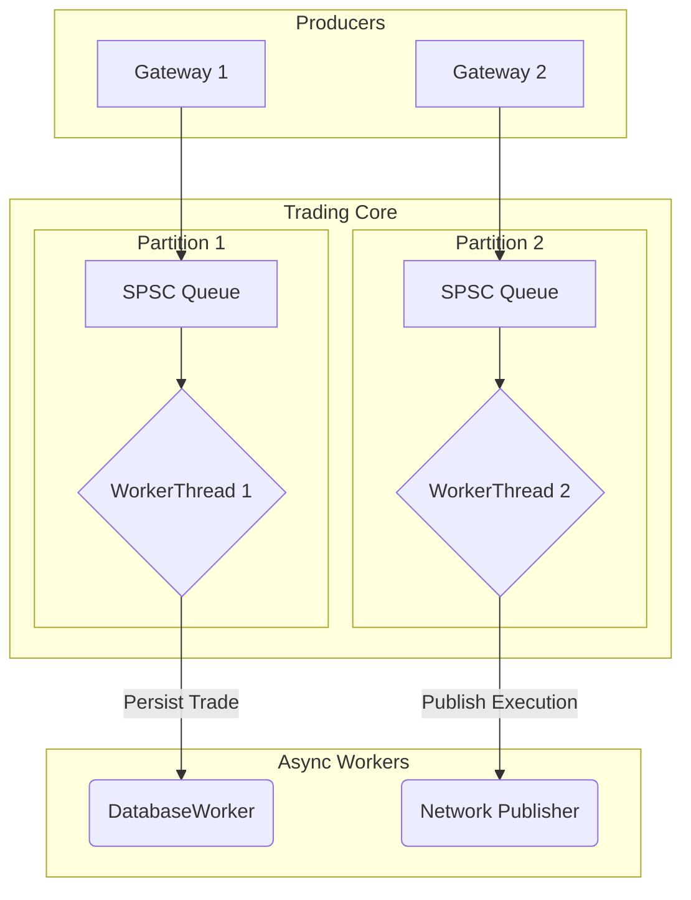

# Trading Core: Technical System Design (TSD)

This document provides a detailed technical specification of the `core/trading_core` module. It is intended for developers who want to understand the internal workings of the matching engine, its threading model, and its performance characteristics.

## 1. Core Design Patterns

The `trading_core` is built on a set of modern C++ design patterns chosen to meet the system's demanding requirements for low latency, high throughput, and determinism.

| Pattern | Implementation | Benefit |
| :--- | :--- | :--- |
| **Partitioned Single-Writer** | Each instrument is assigned to a `Partition` with a single `WorkerThread` that is the only writer for that partition's state. | Eliminates the need for locks on the critical path, ensuring low-latency and deterministic command processing. |
| **Command Sourcing** | All state changes are initiated by `Command` objects (`NewOrder`, `CancelOrder`) processed sequentially. | Provides a replayable, deterministic log of all actions, which is invaluable for testing and debugging. |
| **Asynchronous I/O** | All blocking operations, such as database writes and network I/O, are offloaded to background threads. | The core matching engine never blocks, allowing it to focus solely on processing orders. |
| **Test-Driven Development** | The system is designed to be easily testable, with deterministic helpers to drive state changes one step at a time. | Ensures correctness and allows for rapid, confident development. |

## 2. Component Responsibilities

The `trading_core` is composed of several key components, each with a distinct responsibility.

| Component | Description |
| :--- | :--- |
| **`TradingCore`** | The top-level orchestrator. It initializes and manages the lifecycle of all `Partitions` and shared services like the `DatabaseWorker`. |
| **`Partition`** | A logical processing unit for a set of instruments. It owns the `WorkerThread`, command queue, and all other components for its instruments. |
| **`WorkerThread`** | The engine of a partition. It runs a tight loop that dequeues commands in batches and orchestrates the entire processing pipeline. |
| **`OrderManager`** | The "source of truth" for all live orders. It owns the `Order` objects and provides O(1) lookup by Order ID. |
| **`OrderBook`** | A data structure that maintains the sorted bid and ask levels for an instrument, enabling efficient matching. |
| **`Matcher`** | The component that implements the core matching logic. It takes an incoming order and matches it against the `OrderBook`. |
| **`RiskManager`** | A pluggable component for enforcing risk limits. It performs pre-trade checks on incoming orders. |

## 3. Threading and Concurrency Model

The threading model is designed to maximize concurrency while minimizing contention.

1.  **Producers**: External clients (e.g., gateways, test harnesses) create `Command` objects and push them into a `Partition`'s dedicated SPSC (Single-Producer, Single-Consumer) queue.
2.  **Consumers**: The `WorkerThread` for that partition is the sole consumer of the queue. It dequeues commands in batches and processes them sequentially.
3.  **Asynchronous Workers**: Any I/O-bound tasks, such as persisting trades to the database or publishing execution reports, are handed off to background worker threads (e.g., the `DatabaseWorker`).

This model ensures that the hot path (the `WorkerThread`'s processing loop) is never blocked by slow I/O operations.

## 4. Command Processing Pipeline

The `WorkerThread` executes the following pipeline for each command:

1.  **Dequeue**: Dequeue a batch of commands from the SPSC queue.
2.  **Process Sequentially**: For each command in the batch:
    a. **Pre-Trade Risk Check**: The `RiskManager` validates the command.
    b. **State Update**: The `OrderManager` and `OrderBook` update their state (e.g., add a new order).
    c. **Matching**: The `Matcher` attempts to match the incoming order against the `OrderBook`.
    d. **Execution Publishing**: Any resulting trades are published via the `ExecutionPublisher`.
    e. **Persistence**: The `DatabaseWorker` is tasked with persisting the trades and order status changes.

## 5. Matching Algorithm

*   **Priority**: The matching algorithm follows a strict **price-time priority**.
    *   Orders with a better price are matched first.
    *   For orders at the same price, the one that was submitted earlier is matched first.
*   **Execution Price**: The execution price is always the price of the resting order on the book. This is a common convention in exchanges that rewards liquidity providers.
*   **Fills**: The system supports both full and partial fills. If an order is partially filled, its remaining quantity stays on the book at the same time priority.

## 6. Performance and Optimization

*   **Memory Management**: The `OrderManager` uses an object pool to pre-allocate `Order` objects, avoiding heap allocations on the critical path.
*   **Batching**: The `WorkerThread` processes commands in batches to amortize the cost of dequeuing and other fixed overhead.
*   **Cache-Friendly Data Structures**: The `OrderBook` and other data structures are designed to be cache-friendly to maximize performance.
*   **Inlining**: Critical functions in the `Matcher` and `OrderBook` are designed to be easily inlined by the compiler.

## 7. Persistence and Recovery

*   The `data::DatabaseWorker` provides an asynchronous interface for all database operations. It uses a dedicated thread to execute SQLite commands, ensuring the `trading_core` is never blocked.
*   The `TradeIDRepository` provides a persistent backing for the `TradeIDGenerator`, ensuring that trade IDs are unique even across system restarts.
*   **Note**: While the system persists all necessary data, a full snapshot and recovery mechanism is not yet implemented. This would be a key feature for a production system.
