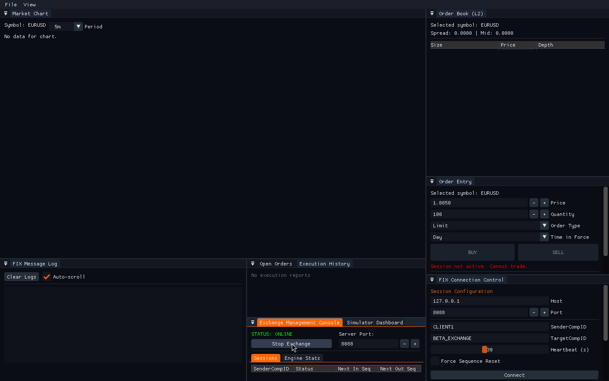
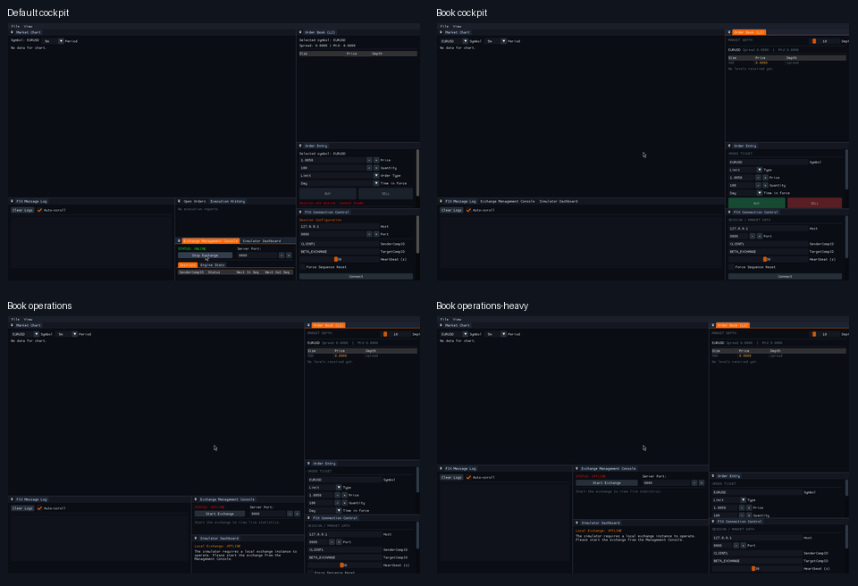

# BetaTrader client terminal UI

This guide documents the verified 1440×900 client layouts after the deterministic DockBuilder arrangement was added. The default cockpit keeps the chart central, the order-book workflow on the right, the FIX log and blotter along the bottom, and exchange/simulator operations in a separate bottom tab group.

## Default cockpit

The default arrangement contains these nine application panels:

| Panel | Placement | Purpose |
| --- | --- | --- |
| Market Chart | central workspace | Candles and symbol/period controls |
| Order Book (L2) | upper-right | Bid/ask depth, spread, mid-price, and depth scale |
| Order Entry | middle-right | Symbol, price, quantity, order type, TIF, BUY/SELL |
| FIX Connection Control | lower-right | Session configuration, connection lifecycle, and market-data subscription |
| FIX Message Log | bottom-left | Session, FIX, execution, rejection, and market-data events |
| Open Orders | bottom-center tab | Working order state |
| Execution History | bottom-center tab | Completed/rejected/cancelled execution history |
| Exchange Management Console | bottom-right tab | Embedded exchange lifecycle and session/engine statistics |
| Simulator Dashboard | bottom-right tab | Local stochastic simulator controls and status |

## Panel-by-panel captures

The individual captures are crops from the same expanded default cockpit so that every panel title and control region can be inspected without overlap:

- [Market Chart](screenshots/panel-market-chart.png)
- [Order Book](screenshots/panel-order-book.png)
- [Order Entry](screenshots/panel-order-entry.png)
- [FIX Connection Control](screenshots/panel-fix-connection-control.png)
- [FIX Message Log](screenshots/panel-fix-message-log.png)
- [Open Orders / Execution History tabs](screenshots/panel-open-orders-and-execution-history.png)
- [Exchange Management Console / Simulator Dashboard tabs](screenshots/panel-exchange-and-simulator.png)
- [Panel gallery](screenshots/panel-gallery.png)

## Order-book workflow layouts

These layouts keep the book and order-entry workflow visible while changing the amount of operational workspace exposed. They are preview layouts; the deterministic default cockpit remains the production default.

- [Book cockpit](screenshots/book-layout-cockpit.png): chart, L2 book, order ticket, FIX controls, and bottom operational tabs.
- [Book operations](screenshots/book-layout-operations.png): more room for exchange/simulator monitoring below the chart.
- [Book operations-heavy](screenshots/book-layout-operations-heavy.png): larger monitoring area for operational workflows.
- [Book-focused detail](screenshots/book-focused-detail.png): enlarged right-side book, order-entry, and connection workflow.
- [Book-focused workflow](screenshots/book-focused-workflow.png): enlarged right-side workflow with the bottom operational tabs visible.

## Capture and verification notes

- Captures are 1440×900 PNGs produced from the native `client_app` under Xvfb with multi-viewport disabled only for deterministic headless geometry. The production multi-viewport setting remains enabled in `UIManager.cpp`.
- The default frame demonstrates the expanded, non-overlapping dock arrangement and the embedded exchange console state. Empty book/chart areas are intentional in a layout capture when no FIX session is subscribed; connect, log on, subscribe to market data, and start the simulator to populate them.
- The source layout was built with the repository CMake preset and checked with the full CTest suite plus the focused `ClientWorkingClientSmoke` test. `git diff --check` also passed.
