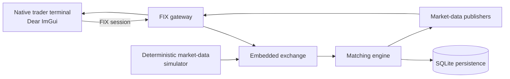

# BetaTrader documentation

<div class="bt-hero"><span class="bt-eyebrow">NATIVE C++ / FX / FIX / IMGUI</span><span class="bt-hero-title">Build, inspect, and run the complete trading system</span><span class="bt-hero-description">BetaTrader is a self-contained FX trading platform: a partitioned matching engine, an embedded exchange, a FIX gateway, a native trader terminal, and a deterministic market-data simulator.</span><span class="bt-chips"><span class="bt-chip">C++23</span><span class="bt-chip">ASIO</span><span class="bt-chip">FIX 4.x</span><span class="bt-chip">SQLite</span><span class="bt-chip">Dear ImGui</span></span></div>

## Start here

| If you want to… | Read |
| --- | --- |
| Understand the system boundary and build it | This overview and the [client application guide](\ref md_client_2client__app_2README) |
| Explore the exchange and matching path | [Exchange overview](\ref md_exchange_2README), [matching engine](\ref md_exchange_2exchange__matching_2README), and [persistence](\ref md_exchange_2exchange__persistence_2README) |
| Understand FIX sessions and wire conversion | [FIX gateway overview](\ref md_exchange_2exchange__fix_2README) and [client FIX guide](\ref md_client_2client__fix_2README) |
| Work on the native terminal | [Client UI guide](\ref md_client_2client__ui_2README), [order book](\ref md_client_2client__orderbook_2README), and [simulator](\ref md_client_2client__simulator_2README) |
| Verify a change | Follow the [verification runbook](#verification-runbook) below |

## System map



The normal local-demo path keeps every component on the same machine. The terminal connects to the embedded exchange over loopback FIX; the simulator creates reproducible order flow; the exchange publishes snapshots and incremental updates; and the UI renders the resulting depth, candles, blotters, and session state.

## Repository map

| Area | Responsibility | Entry point |
| --- | --- | --- |
| `common/` | Shared orders, trades, instruments, FIX models, and serialization types | Common headers |
| `exchange/` | Exchange composition, routing, matching, risk, FIX server, publishers, and persistence | [Exchange overview](\ref md_exchange_2README) |
| `client/client_app/` | Composition root, lifecycle, networking thread, and render loop | [Client application guide](\ref md_client_2client__app_2README) |
| `client/client_fix/` | Asynchronous FIX client session and protocol adapters | [Client FIX guide](\ref md_client_2client__fix_2README) |
| `client/client_ui/` | Terminal panels, docking layout, chart, connection controls, and blotters | [Client UI guide](\ref md_client_2client__ui_2README) |
| `client/client_simulator/` | Stochastic local order-flow and market-data generation | [Simulator guide](\ref md_client_2client__simulator_2README) |
| `client/client_ohlc/` | Live aggregation plus deterministic local-demo candle backfill | OHLC headers and tests |

## Verification runbook {#verification-runbook}

Run these commands from the repository root:

```bash
cmake --preset default
cmake --build build -j2
ctest --test-dir build --output-on-failure
ctest --test-dir build -R '^ClientWorkingClientSmoke$|CandleAggregatorTest|DatabaseWorkerTests' --output-on-failure
git diff --check
```

The loopback smoke test is the authoritative client-path check: it starts the embedded exchange, connects and authenticates the FIX client, subscribes to EURUSD, routes snapshot and incremental market data, exercises order state, and verifies clean logout. It never places an external or live-market order.

## Native terminal demo

1. Build the project with the default CMake preset.
2. Start `./build/client/client_app/client_app` in a working GLFW/OpenGL display.
3. In the terminal, start the embedded exchange and local simulator.
4. Connect, log on, and subscribe to EURUSD from **FIX Connection Control**.
5. Inspect the central chart, live L2 book, order entry, FIX log, blotters, and operations tabs.

The terminal seeds local-demo OHLC candles immediately before the current live bucket. Those candles are simulated documentation/demo data, not an assertion about external historical prices. See the [client UI guide](\ref md_client_2client__ui_2README) for the verified cockpit and focused panel captures.

## Documentation boundaries

- Generated HTML lives in `docs/html/` and is intentionally ignored by Git; regenerate it with `doxygen Doxyfile`.
- The tracked source of the generated site is `Doxyfile`, the custom header/footer/stylesheets, this page, and the module Markdown files.
- `vendor/` and test/mock implementation details are excluded from the generated site to keep navigation focused on BetaTrader-owned code.
- Local-demo simulation and loopback FIX behavior are safe development workflows; do not interpret them as production connectivity or market-data provenance.
