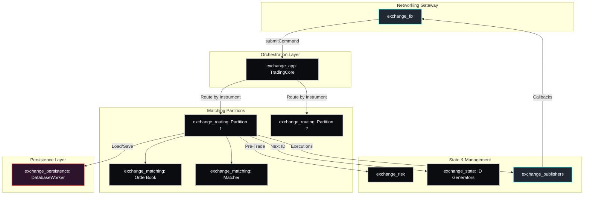

# Exchange | Modular Trading Infrastructure

The `exchange/` directory contains the core server-side infrastructure for the BetaTrader ecosystem. It is engineered using a **Micro-Module Architecture**, where each logical component (matching, risk, persistence, networking) is isolated into a standalone C++ library with its own unit tests.

## Architecture & System Flow

The Exchange operates as a high-performance, partitioned matching engine. Instead of a single monolithic process, it is a collection of optimized modules orchestrated by the `exchange_app` daemon.



## The Micro-Modules

Explore the individual `README.md` files for detailed class diagrams, data structures, and design patterns:

1.  **[`exchange_app`](./exchange_app/README.md)**: The top-level orchestrator and singleton manager (`TradingCore`).
2.  **[`exchange_fix`](./exchange_fix/README.md)**: FIX 4.4 server implementation, session management, and binary converters.
3.  **[`exchange_matching`](./exchange_matching/README.md)**: Pure C++ OrderBook and Matcher logic (Price-Time Priority).
4.  **[`exchange_persistence`](./exchange_persistence/README.md)**: Asynchronous SQLite persistence, repositories, and DB workers.
5.  **[`exchange_publishers`](./exchange_publishers/README.md)**: Market Data and Execution broadcast logic.
6.  **[`exchange_risk`](./exchange_risk/README.md)**: Pre-trade risk checks and post-trade state updates.
7.  **[`exchange_routing`](./exchange_routing/README.md)**: Command partitioning, `Partition` management, and dedicated worker threads.
8.  **[`exchange_state`](./exchange_state/README.md)**: Thread-safe ID Generators (`OrderID`, `TradeID`) and `OrderManager`.

## Design Philosophy

-   **Lock-Free Command Path**: Every `Partition` has its own dedicated thread and `SPSCQueue`, eliminating contention between symbols.
-   **Dependency Injection**: Components are designed to be injected (e.g., `TradingCore` constructor), making the system highly testable with mocks.
-   **Zero-Copy Principles**: Binary message converters avoid intermediate strings or allocations wherever possible.
-   **Asynchronous I/O**: Database writes and networking events are handled on separate threads to keep the matching loop at microsecond latencies.

## Building and Testing

You can build the entire exchange or target specific mini-libraries:

```bash
# Build the main server
cmake --build build --target fix -j$(nproc)

# Build all exchange tests
cmake --build build --target exchange_app_tests -j$(nproc)

# Run tests
ctest -R exchange_
```
