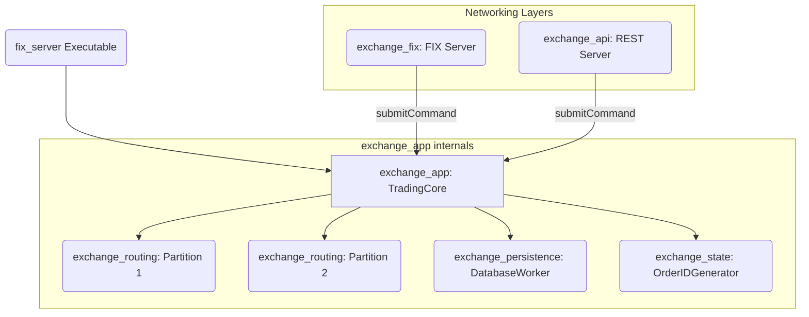
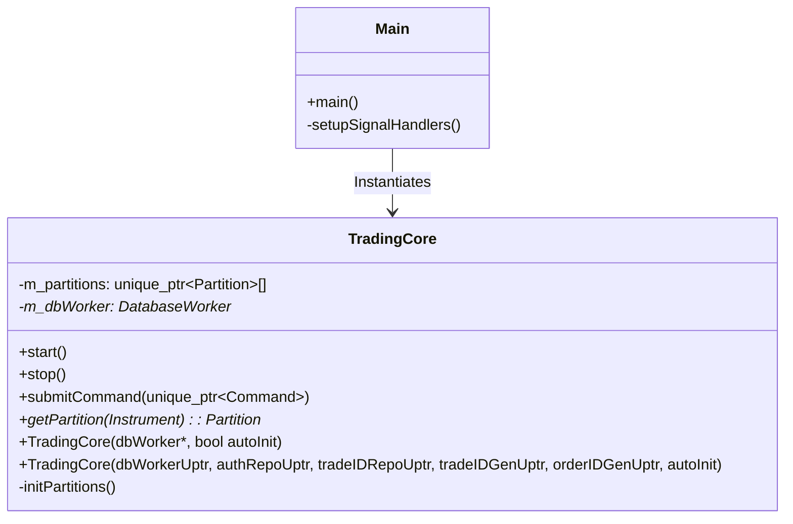

# Exchange | App Orchestrator & Daemon

The `exchange_app` module is the top-level assembly for the BetaTrader Exchange server. It acts as the "braid" that weaves together the matching partitions, risk management, and protocol gateways into a single functional daemon.

## Overview

Unlike the micro-modules it contains, `exchange_app` is responsible for global lifecycle management. It handles the instantiation of singleton resources (like `DatabaseWorker` and ID Generators), initializes the instrument-specific matching partitions, and provides the public `submitCommand` interface used by networking gateways.

## Key Responsibilities

*   Initialize the global `DatabaseWorker` for asynchronous persistence.
*   Construct and own the `Partition` array based on the `Instrument` enumeration.
*   Provide a centralized `TradingCore` facade for command dispatch.
*   Orchestrate orderly shutdown and queue draining during maintenance.
*   Maintain the instance singleton for global access.

## Architecture

## Class Diagram

## Component Responsibilities

| Component | Description |
| :--- | :--- |
| **`TradingCore`** | The central facade. It routes incoming commands to the specific `Partition` responsible for a given instrument. |
| **`Main`** | Entry point. Parses CLI arguments, sets up logging, and blocks on the `io_context` while the engine runs. |

## Critical Design Conventions

-   **Partition Isolation**: `TradingCore` ensures that a command for `EURUSD` never touches the state of `USDJPY` by routing exclusively to the dedicated partition.
-   **Resource Ownership**: This module is the "parent" of the server stack; objects created here are passed by reference down into the child micro-modules to enforce a clear ownership hierarchy.
