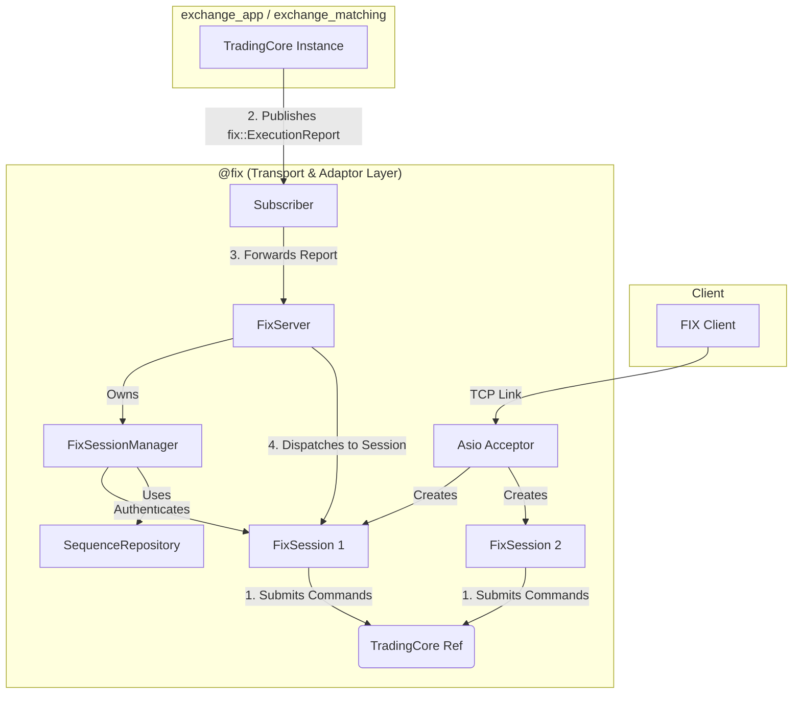

# Exchange | FIX Gateway & Session Manager

The `exchange_fix` component is a standalone server responsible for handling client connections over the Financial Information eXchange (FIX) protocol. It acts as the primary gateway for clients to submit orders to the BetaTrader trading engine.

## Overview

This component implements a fully asynchronous, multi-client FIX server using the Asio networking library. It listens for incoming TCP connections, manages client sessions, and translates FIX messages into commands for the `exchange_app`.

## Key Responsibilities

*   **Accepting Connections**: Listens on a configured TCP port for new client connections.
*   **Session Management**: Manages the lifecycle of each client session via `FixSessionManager`, including authentication and sequence number validation.
*   **Message Processing**:
    *   Deserializes FIX messages into internal request objects.
    *   Uses `OutboundMessageBuilder` for consistent, protocol-compliant binary FIX serialization (BodyLength, Checksum).
    *   Submits commands to the `exchange_app`.
*   **Execution Reporting**:
    *   Subscribes to execution events and routes them to the correct session.

## Architecture

The system is designed with a clear separation of concerns between the transport layer (`exchange_fix`) and the business logic layer (`exchange_app` / `exchange_matching`). Communication is achieved via an asynchronous publisher-subscriber pattern.



## Key Components

-   **`FixServer`**: Top-level server class that owns the Asio acceptor and session map.
-   **`FixSession`**: Represents a single connected client, managing the async read/write loop.
-   **`FixSessionManager`**: Thread-safe manager of session state, keyed by `SenderCompID` (not connection ID). Maintains a two-map indirection (`connectionId → compId → SessionState`) so that sequence numbers persist across client reconnections. All public methods are mutex-protected for safe cross-thread access.
-   **`OutboundMessageBuilder`**: Centralized utility for constructing binary FIX strings including Checksum and BodyLength.
-   **`FixUtils`**: Shared parsing and formatting helpers.

## Session Lifecycle

1.  **Connection**: TCP connection is accepted and a `FixSession` is created.
2.  **Logon (35=A)**: `FixSessionManager` authenticates the `SenderCompID` against the database and links the connection ID to the CompID.
3.  **Authentication & Recovery**: Retrieves or initializes persistent sequence numbers for the CompID via `SequenceRepository`. Existing state survives across reconnections.
4.  **Sequencing**: Every subsequent message must have a valid `MsgSeqNum` (34). Gaps trigger a `ResendRequest`. Outbound sequences are incremented and persisted atomically via `useNextOutboundSequence()`.
5.  **Logout (35=5)**: Outbound sequence is captured first, then the session is marked offline. Connection mapping is cleaned up after the logout acknowledgment is sent.

## Order Lifecycle

The FIX Gateway translates client messages into internal commands and routes them to the `exchange_app`:
-   **New Order Single (35=D)** -> `trading_core::NewOrder`
-   **Order Cancel Request (35=F)** -> `trading_core::CancelOrder`
-   **Order Cancel/Replace Request (35=G)** -> `trading_core::ModifyOrder`

## Building and Running

The FIX server is built as a separate executable target named `fix_server`.

1.  **Build the target**:
    ```bash
    cmake --build . --target fix_server
    ```
2.  **Run the server**:
    ```bash
    ./build/exchange/exchange_fix/fix
    ```

## Future Enhancements and TODOs

*   **Heartbeat Management**: Automatically send TestRequests and track latency.
*   ~~**Sequence Number Persistence**~~: ✅ Implemented — sequence numbers are persisted via `SequenceRepository` and survive server restarts.
*   **Market Data Integration**: Connect `MarketDataRequest` handlers to the actual engine snapshots.
*   **ResendRequest Handling**: Implement outbound message caching to support proper gap-fill responses.
