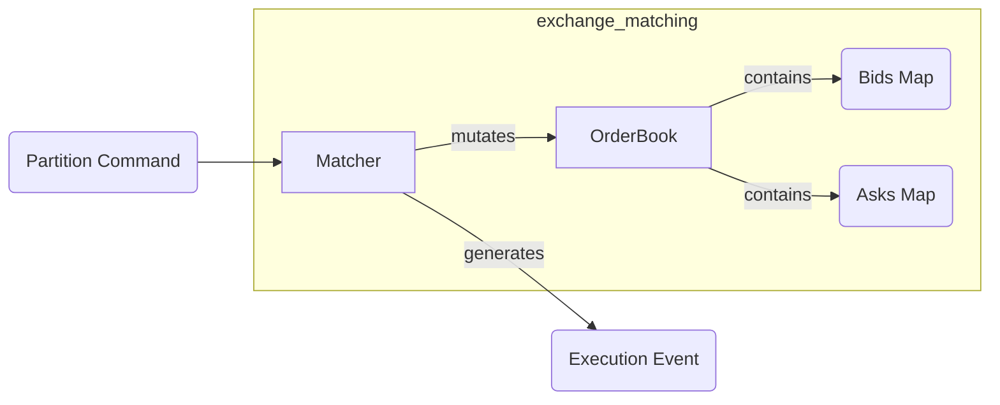
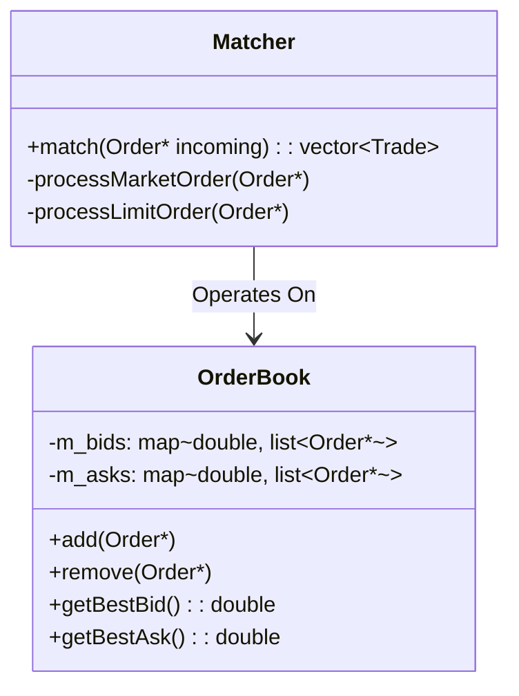

# Exchange | Matching Engine

The `exchange_matching` module contains the fundamental "brain" of the exchange: the matching arithmetic and the orderbook data structures.

## Overview

This module is designed for pure, deterministic execution. It has no knowledge of networking, threading, or database I/O. Given a new order, it either rests it in the book or matches it against existing liquidity to produce execution reports.

## Key Responsibilities

*   Maintain a strictly sorted Price-Time Priority orderbook (LOB).
*   Implement the core `match` algorithm.
*   Provide efficient O(1) or O(log N) price level lookups.
*   Support Limit, Market, and IOC (Immediate or Cancel) order types.

## Architecture

## Class Diagram

## Component Responsibilities

| Component | Description |
| :--- | :--- |
| **`OrderBook`** | A highly optimized container segmenting limit orders by price and arrival time. |
| **`Matcher`** | The logic block that iterates through the opposite side of the book until the incoming order is filled or the price crosses. |

## Critical Design Conventions

-   **Purity**: No `mutex` usage or blocking calls. All synchronization is handled at the `routing` level before calls enter the matching logic.
-   **Zero Allocations**: During the match loop, existing order pointers are moved; no new heap objects are created for resting orders.
