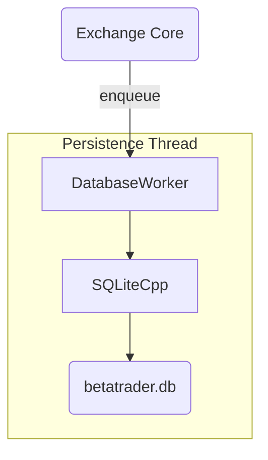
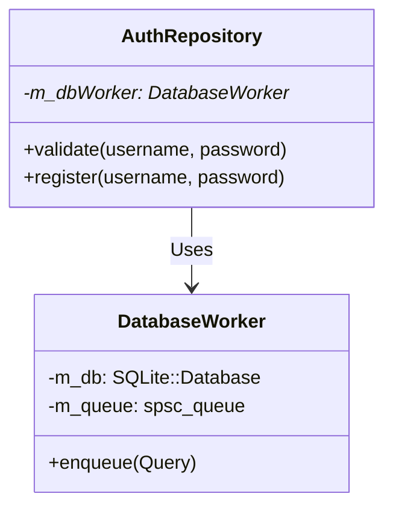

# Exchange | Persistence Layer

The `exchange_persistence` module (formerly `core/data`) provides the interface for all durable storage operations required by the exchange.

## Overview

BetaTrader uses SQLite for persistent storage of user credentials, order history, and trade executions. Because disk I/O is slow, this module is designed to operate asynchronously, ensuring the Matching Engine is never waiting for a disk flush.

## Key Responsibilities

*   Manage the `DatabaseWorker` thread.
*   Perform CRUD operations for `AuthRepository` (Logins).
*   Persist every executed trade to the `trades` table.
*   Maintain sequence numbers for ID recovery.

## Architecture

## Class Diagram

## Component Responsibilities

| Component | Description |
| :--- | :--- |
| **`DatabaseWorker`** | Owns the physical SQLite connection. Drains a dedicated SPSC queue to perform writes. |
| **`AuthRepository`** | Domain-specific wrapper for user-related queries. |
| **`TradeIDRepository`**| Persists the progress of the `TradeIDGenerator`. |

## Critical Design Conventions

-   **Asynchronous Writes**: The main thread "fires and forgets" its query intentions.
-   **Synchronous Reads (Cold Path)**: Only at server startup or during login are synchronous reads permitted, as these operations are not latency-critical for the trading path.
