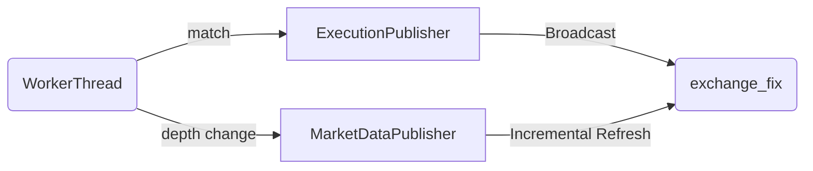
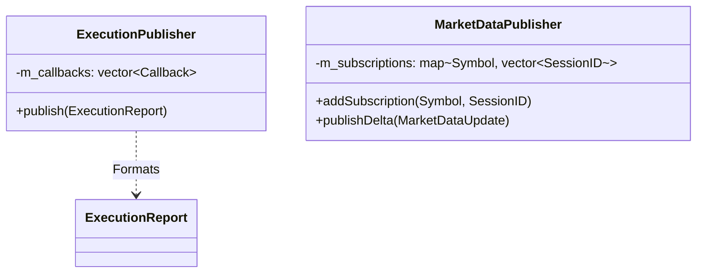

# Exchange | Event Publishing

The `exchange_publishers` module is the outbound broadcast layer of the matching engine. It translates internal matching outcomes into structured events that networking gateways can distribute.

## Overview

After a match occurs, the results must be communicated to the world. `exchange_publishers` decouples the matching logic from the networking logic. It takes raw trade or book update data and formats it for consumption by the FIX server or a hypothetical WebSocket gateway.

## Key Responsibilities

*   Provide an interface for `ExecutionReport` broadcasting.
*   Manage `MarketDataPublisher` for Level 2 depth updates.
*   Abstract the destination of these events (Console, FIX, or Files).
*   Handle subscription-based routing (only send market data to interested clients).

## Architecture

## Class Diagram

## Component Responsibilities

| Component | Description |
| :--- | :--- |
| **`ExecutionPublisher`** | Distributes filled trade notifications. Critical for updating client order blotters. |
| **`MarketDataPublisher`** | Manages the fan-out of L2 book updates. Implements basic multicast-style logic over unicast TCP sessions. |

## Critical Design Conventions

-   **Non-Blocking**: Publishers must not perform direct socket writes if the buffer is full. They should enqueue to outbound networking buffers to prevent matching thread stalls.
-   **Abstract Interfaces**: Allows the server to run in a "Headless" mode (logging to stdout) or a "Networked" mode (transmitting via FIX) without changing the core engine code.
