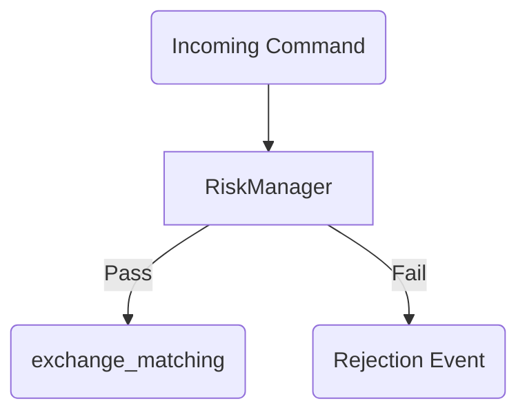
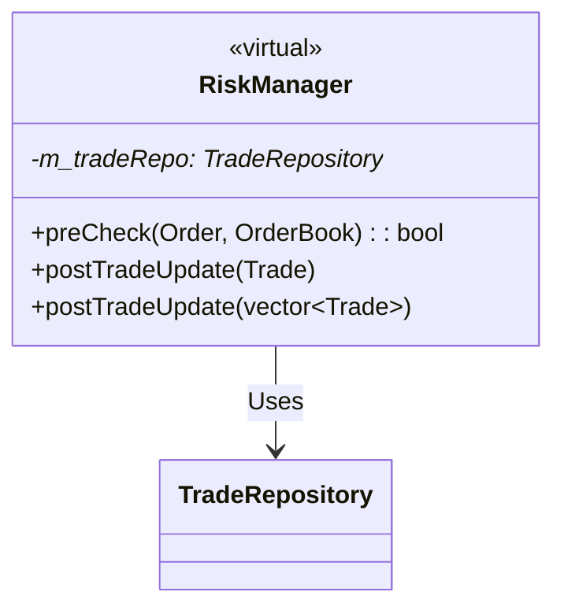

# Exchange | Risk Management

The `exchange_risk` module handles pre-trade validation to ensure that newly submitted orders do not violate exchange-wide safety parameters.

## Overview

Before an order is allowed to reach the matching engine, it must pass through the `RiskManager`. This protects the exchange from "fat-finger" errors, abusive high-frequency behavior, or breach of credit limits.

## Key Responsibilities

*   Validate order price against the current "Market Band" (e.g., no orders >10% away from mid-price).
*   Enforce Maximum Order Quantity (MOQ) limits per instrument.
*   Check for Wash Trading (a client matching against themselves).
*   Verify sufficient balance/margin before acceptance (placeholder for future implementation).

## Architecture

## Class Diagram

## Component Responsibilities

| Component | Description |
| :--- | :--- |
| **`RiskManager`** | The guardian of the partition critical path. Returns a simple boolean `Accept/Reject`. |
| **`RiskConfig`** | A static or dynamically reloadable struct containing the thresholds for different instruments. |

## Critical Design Conventions

-   **Fail-Fast**: Risk checks are the very first step in the partition worker thread's command loop. Rejections occur before the order occupies any matching memory.
-   **Deterministic**: Risk evaluation must be O(1) in the critical path to avoid introducing latency jitter.
