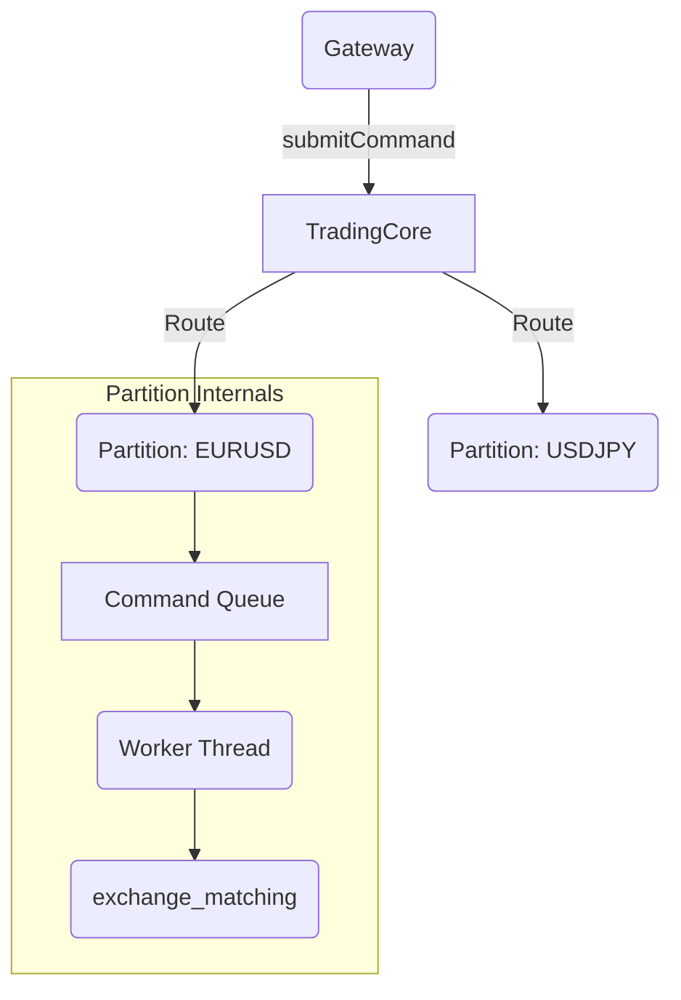
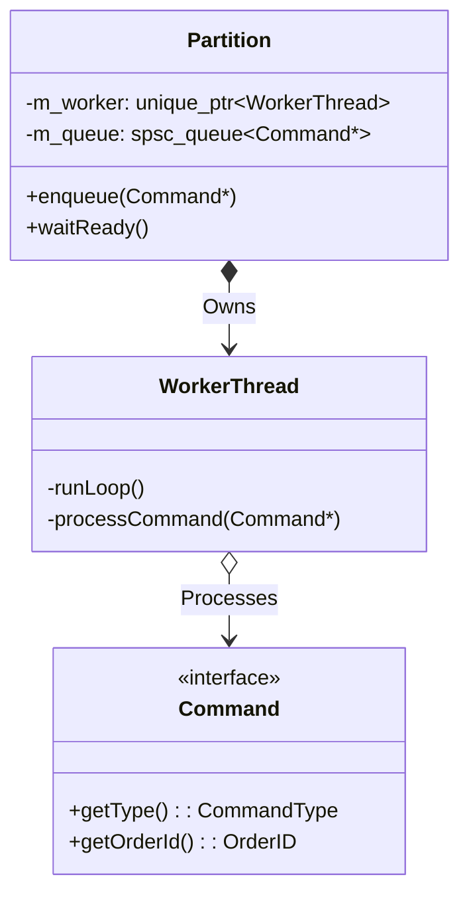

# Exchange | Command Routing & Partitioning

The `exchange_routing` module manages the concurrent topology of the exchange. It implements the "Single-Writer" pattern by partitioning instruments across dedicated worker threads.

## Overview

To achieve massive throughput, the exchange does not use a single global mutex. Instead, every instrument (e.g., EURUSD) is assigned to a specific `Partition`. Each partition has its own lock-free command queue and a dedicated thread, ensuring that matching for one symbol never blocks matching for another.

## Key Responsibilities

*   Implement the `Partition` container lifecycle.
*   Manage the `WorkerThread` event loop.
*   Provide lock-free SPSC (Single-Producer Single-Consumer) command queues.
*   Provide a unified `Command` interface for `New`, `Modify`, and `Cancel` operations.

## Architecture

## Class Diagram

## Component Responsibilities

| Component | Description |
| :--- | :--- |
| **`Partition`** | A logical silo of execution. Owns all state (Book, OrderManager) for its assigned instruments. |
| **`WorkerThread`** | A high-priority system thread pinned (optionally) to a CPU core to drain the command queue. |
| **`Command`** | The common payload format used to move intentions from the networking gateway into the matching engine. |

## Critical Design Conventions

-   **Single Writer**: Only one thread is EVER allowed to call `exchange_matching` or `exchange_state` for a given instrument.
-   **No Sleeping**: In high-load scenarios, the `WorkerThread` can switch to a busy-wait (spin) strategy to minimize context-switch latency.
