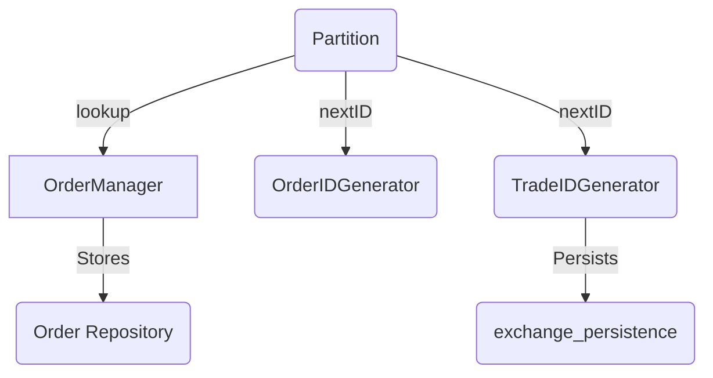
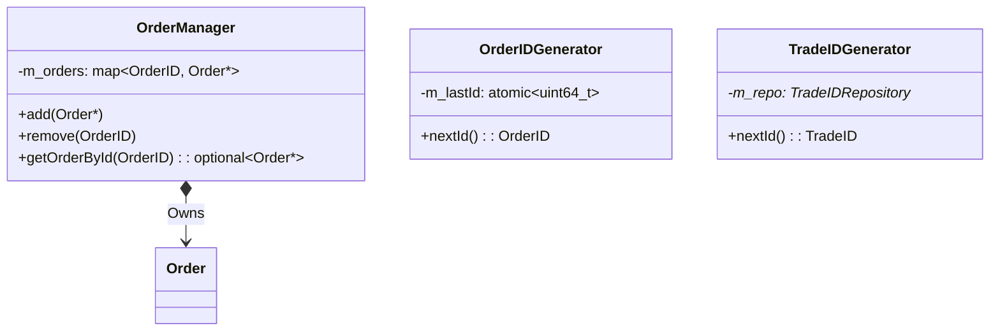

# Exchange | State Management

The `exchange_state` module acts as the authoritative repository for all active order entities and global sequence generators within the exchange.

## Overview

State is precarious in a high-frequency trading system. `exchange_state` provides the single source of truth for "active" orders and ensures that every new Order or Trade across the entire cluster (all partitions) receives a globally unique, monotonically increasing identifier.

## Key Responsibilities

*   Provide centralized `OrderManager` logic for tracking order existence.
*   Generate globally unique `OrderIDs`.
*   Generate globally unique `TradeIDs`.
*   Maintain the mapping between `ClientOrderID` (from FIX) and `OrderID` (internal).

## Architecture

## Class Diagram

## Component Responsibilities

| Component | Description |
| :--- | :--- |
| **`OrderManager`** | The memory store for live orders. Partition workers use this to find orders for cancellation or modification. |
| **`OrderIDGenerator`**| Fast, in-memory atomic counter for rapid order assignment. |
| **`TradeIDGenerator`**| Persistence-aware generator that ensures IDs never repeat even after a server crash. |

## Critical Design Conventions

-   **Memory Safety**: The `OrderManager` within a partition is the exclusive owner of order memory. Moving orders between partitions is explicitly forbidden.
-   **Lock-Free ID Generation**: `OrderIDGenerator` uses pure atomics, allowing it to be shared across partitions without causing contention.
